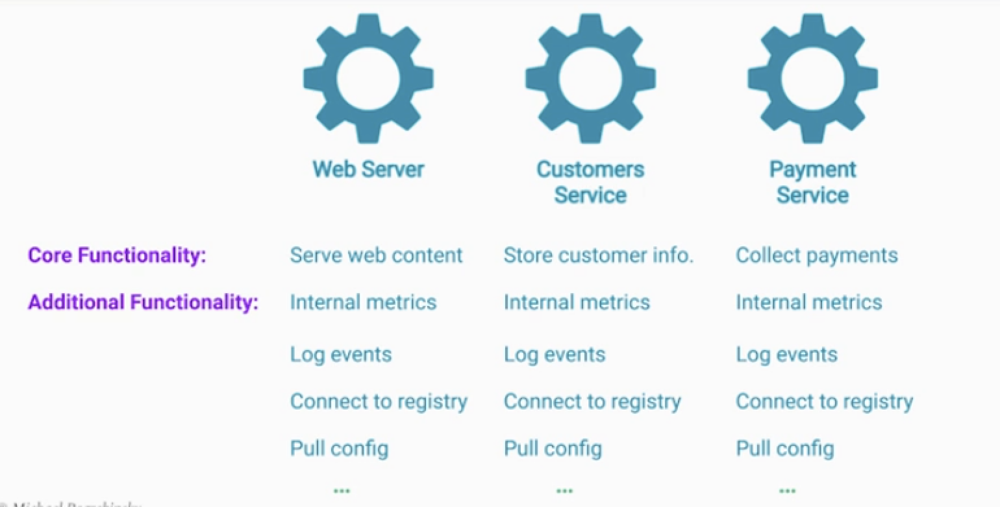
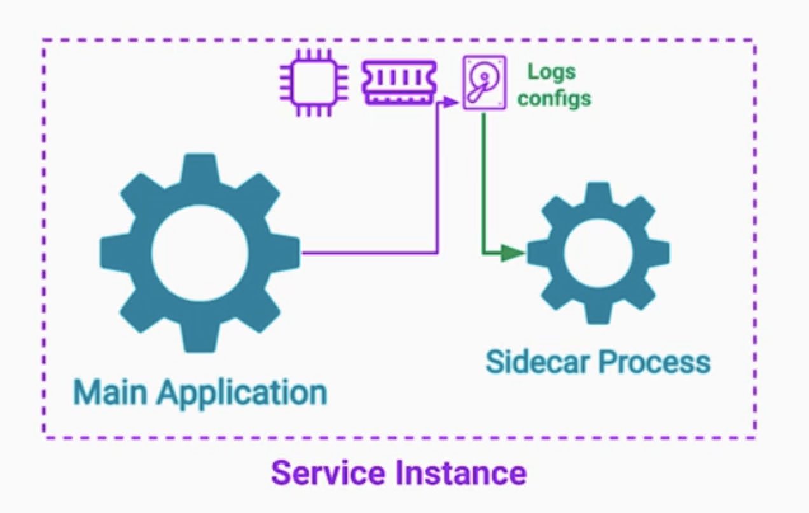
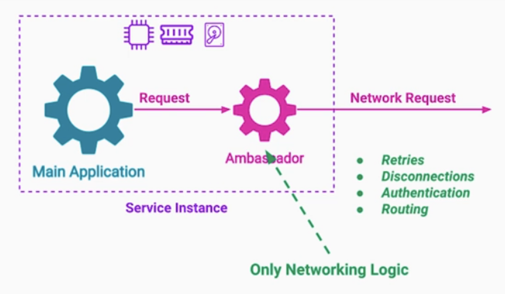
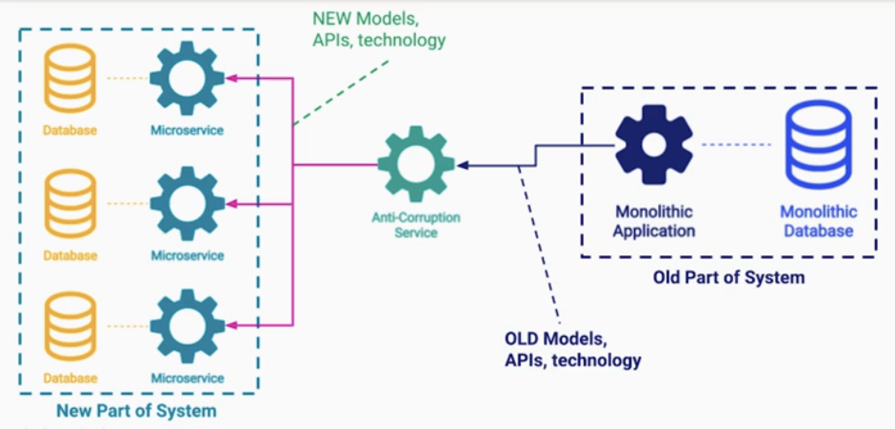
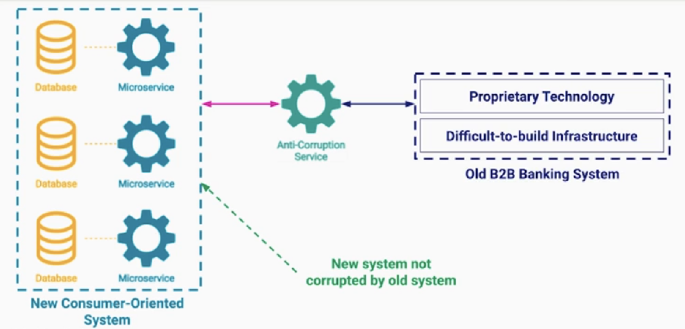
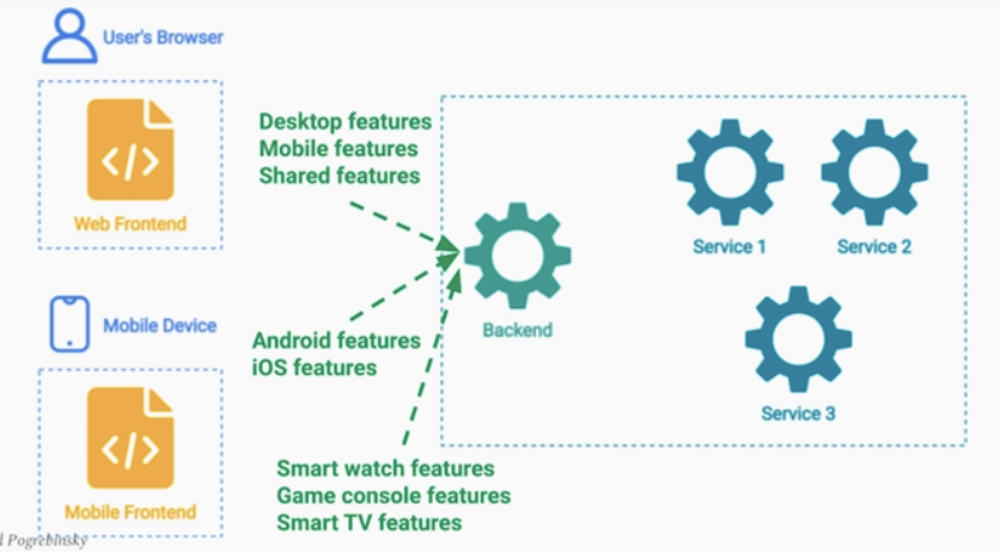
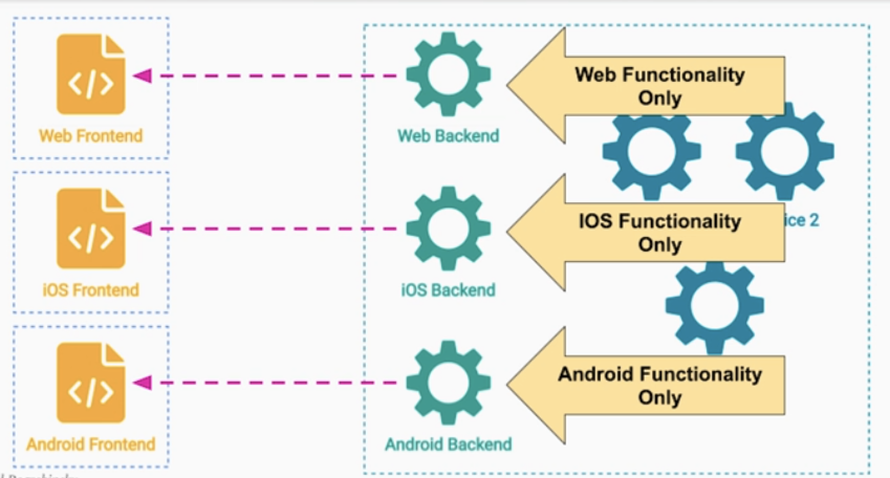
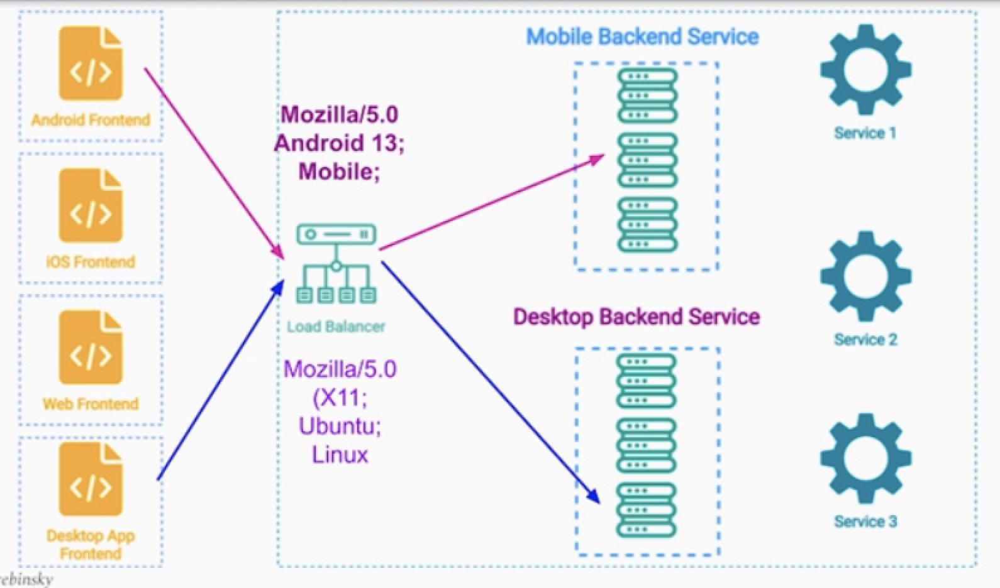

# Cloud SW 아키텍처 패턴:Extensibility Patterns   

- [Cloud SW 아키텍처 패턴:Extensibility Patterns](#cloud-sw-아키텍처-패턴extensibility-patterns)
  - [Extensibility Patterns](#extensibility-patterns)
  - [Sidecar Pattern](#sidecar-pattern)
    - [해결해야할 문제](#해결해야할-문제)
    - [솔루션:Sidecar Pattern](#솔루션sidecar-pattern)
    - [Ambassador Pattern](#ambassador-pattern)
  - [Anti-Corruption Adapter Pattern](#anti-corruption-adapter-pattern)
    - [문제점1 및 해결](#문제점1-및-해결)
    - [문제점2 및 해결](#문제점2-및-해결)
    - [고려점](#고려점)
  - [BFFs Pattern](#bffs-pattern)
    - [문제점](#문제점)
    - [솔루션](#솔루션)

## Extensibility Patterns   
---
3.기능 확장성 아키텍처 패턴 - Software Extensibility Architecture Patterns     

기능 확장성 아키텍처 패턴을 도입으로 얻는 이점은 무엇일까?  

 

## Sidecar Pattern

### 해결해야할 문제

위 그림처럼 3개의 서비스가 있다.   
- 각 서비스들의 핵심기능들이 존재 한다. 그 외에도 공통적으로 들어가는 부가 기능들이 있다.  
- 서비스 메트릭 정보 수집, 로그 인벤트 정보 수집, 타 서비스 endpoint 정보들이 담긴 registry 정보, 환경구성파일 가져오기 등  
- 각 서비스들은 java, python, go 언어로 서로다른 언어를 사용하고 있어서, 부가기능을 각자 환경에 맞는 라이브러리를 쓸 수 있다.  
- 이런 경우는 재사용성과 오류등의 문제점이 내포되어 있다.   

### 솔루션:Sidecar Pattern

사이드카 패턴으로 해결이 가능하다.  
- 사이트카는 차량의 외부에 붙어있는 보조석 이다.   
- 이런 상황처럼, 메인앱 옆에 별도의 프로세스나 컨테이너로 사이드카를 뛰운다.  
- 사이드카는 메인앱이 사용하고 있는 cpu,memory,disk에 접근이 가능하다.  
- 메인 앱 대신 리소스 사용량을 모니터링할 수 있고, 
- 메인 앱 대신 로그파일을 수집할 수 있고,
- 메인 앱 대신 환경구성 파일등을 가져와서 디스크에 넣어줄 수 있다.  

여러가지 장점들이 존재하는데 
- 이런 사이드카는 메인앱의 언어에 상관없이 구현이 가능하다.  
- 사이드카만 따로 버전업데이트를 시켜줄 수 있다.   

### Ambassador Pattern

사이드카의 한 가지 특정 유형이 ambassador 패턴이다.  
- 메인 앱을 대신해서 모든 네트워크 요청을 전송한다.  
- 프록시와 비슷하지만 더 많은 기능을 가지고 있다.  
- Retires, Disconnections, Authentication, Routes...

장점은 분산환경에서 네트워크 추적이 용이해진다.  
- 네트워크 전체 플로우를 확인할 수 있으며, 특정 네트워크를 차단할수도 있다.  

## Anti-Corruption Adapter Pattern

손상 방지를 위한 어댑터 패턴  

### 문제점1 및 해결

1.모놀리틱 > MSA 마이그레이션 이슈    
- 굉장히 오래 유지보수되어 코드베이스도 거대해지고 팀도 많아진 서비스  
- MSA로 전환하기 위한 미션이 있다.   
- 개발을 중단하고 한번에 이동시키는것이 아니라 서비스를 하나씩 분리하는 과정을 여러번 반복한다. 

이 과정에서 분리된 MicoService 1번이 기존의 모놀리틱 서비스와 여전히 통신해야 한다.  
- 프로토콜이나, API버전이든 레거시 항목과 유지해야 한다.  

이를 해결하는 방법은 중간에 어댑터 레이어를 두는것이다.   
- MSA는 마치 새로운 서비스처럼 해당 서비스를 바라보면서 데이터를 요청한다.  
- 새로운 시스템은 새로운 모델과 API로 어댑터 서비스에 연결되고, 기존 시스템은 구 모델을 가지고 통신한다.  

### 문제점2 및 해결

2.일부시스템이 여전히 남아있는 경우  
- 새로운 시스템으로 이전해야하지만, 레거시 서비스가 굉장히 구현하기 어렵고, 새로 구현하기에 리소스가 부족한 상황이다.   
- 예를들어 기업형은행에서 B2C 비즈니스 확장으로 이어지는데 B2B 기존 레거시를 이용해야하는 경우이다.  
- 새로운 B2C 비즈니스와 레거시 B2B 서비스 사이에 레이어 서비스를 하나 두고 통신하도록 시스템을 디자인한다.  

### 고려점

anti-corruption 레이어/어댑터 서비스도 개발 공수가 많이 들어간다.  
- 트레이드 오프를 잘 생각해야한다.  
- 개발, 테스트, 배포, 확장성 모두 필요한 어댑터 서비스 이다.  
- 비용을 줄이기 위해서, 어댑터를 cloud fun으로 도입해볼 수 있다.  

## BFFs Pattern

### 문제점

웹 프론트와 통신하고 있는 백앤드서버가 있는데, 서비스의 확장으로 모바일 앱이 들어왔다.  
- 베터리의 상황, 위치정보 등 특수한 비즈니스로직을 수행해야 한다.  
- 웹에만 최적화된 API로 모바일API를 처리하려면 여러 이슈가 발생할 수 있다.   
- 서비스의 복잡도가 올라가는 문제가 발생한다.  

### 솔루션

각 서비스에 최적화된 BFF서버를 둘 수 있다.  
- 하지만 어느정도 공통된 서비스를 제공한다면 shared service를 하나 두고 사용할 수 있다.  
- 혹은 웹/모바일로 2개의 BFF서버를 두는 방식도 고려할 수 있다.  

- 앞단에 로드밸러서를 두고 각 user-agent마다 서로 다른 분기를 칠수도 있다.  
- 모바일 서비스가 로드가 가중되면, mobile service 만 스케일업을 유연하게 할 수 있다.  

