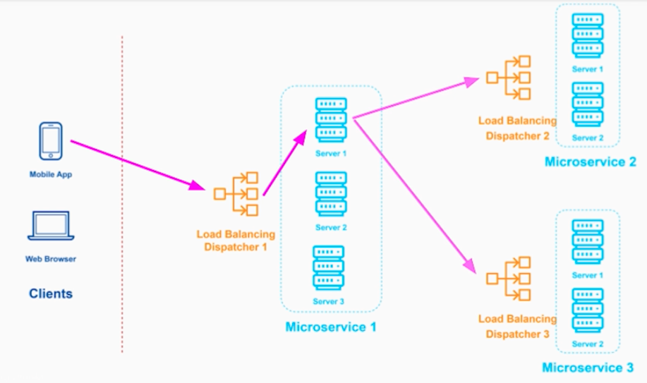
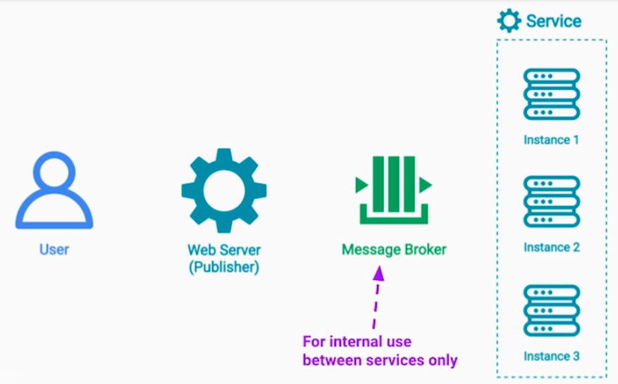
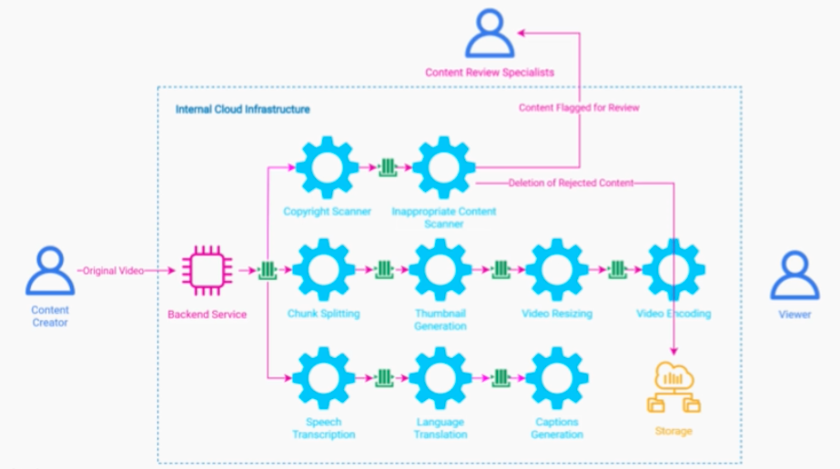

# Cloud SW 아키텍처 패턴:Scalability Patterns

## Scalability Patterns
---

확장성 패턴을 도입으로 얻는 이점은 무엇일까?  
- 수십억개의 요청을 하루에 처리할 수 있다.   
- petabytes급의 데이터를 처리할 수 있다.  
- 비용을 절감할 수 있다.  

 

## LoadBalancing Pattern
---
### 기본

  
트래픽을 분산시킬 수 있는 로드밸런서를 어플리케이션 앞단에 두는것이다.   

 
  
MSA환경에서는 위 그림처럼 N티어 구성으로 배치가 된다.  
트래픽에 유입에 따라서 특정 서비스만 어플리케이션을 늘리면 된다. 그래서 비용절감효과가 있다.     

### Cloud LoadBalancing Service

  
- 첫번째 로드밸러스 패턴 테크닉  
- 단일 고장점이 없도록, Zone마다 LB를 배치한다.  

### Message Broker, Distributed Message Queue

  
- 두번째 로드밸러스 패턴 테크닉  
- 메시지 브로커는 로드밸런싱 목적이 아니긴 하다.  
- 내부 서비스간에 연결에만 사용  

 

## LoadBalancing Algorithm
---

### 라운드 로빈 방식  
- 순차적으로 로드를 전달한다.  
- stateless의 경우에 잘 작동한다.  
- 특정 클라이언트와 세션을 유지하는 경우에는 그렇지 않다.

### Sticky Session / Session Affinity
- 세션을 고정하거나, 세션을 선호하도록 만든다.  

### Least Connection
- 가장 적은 요청을 처리하는 서버에게 트래픽을 우선 부여한다.  

 

## Pipes and Filters Pattern
---

### 기본

  

- 파이프&필터 패턴은 원천 데이터를 일종의 파이프라인을 따라 흐르게 하면서, 데이터를 가공하여 최종 데이터를 저장하는 과정이다.   
- 데이터의 시작 = data source, 데이터 끝 = data sink 라고 정의한다.   
- 각 컴포넌트에서 데이터 처리가 끝난후 서로 메시지만 주고 받아도 된다.   
- 데이터를 반드시 넘길 필요는 없고, 중앙저장소에서 데이터를 읽고 다시 저장해도 괜찮다.  

왜 필요할까?  
- 각 데이터를 처리하는 서비스(언어)가 다른경우, Java 어플리케이션, 파이썬 머신러닝 모델 서비스, c++ cpu 고성능 처리 서비스 등  
- 데이터 처리를 위해 최적화된 서비스가 독립적인 경우에 필요하다.  서비스마다 GPU, CPU, Memory등 리소스 환경 구성이 다를 수 있다.  

이점  
- 다른 언어를 사용하여 개발이 가능하다.  
- 전체 파이프라인을 비용과 성능에 최적화 할 수 있다. 
- 높은 확장성을 가진다. 각 파이프라인의 단계마다 인스턴스 수를 조정할 수 있다.  
- 높은 처리량, 평행하게 데이터 처리를 수행할 수 있다.  

### 사례  

Processing of User Activity data in digital advertising business  
Processing data from IOT (Internet Of Things) Devices 
Ingesting and Processing of Video and Audio files  

  

비디오를 업로드하면 여러가지 데이터 처리 과정이 필요하다.    

main pipe
  - 하나의 비디오 파일을 각 청크별로 나누는 단계   
  - 각 청크마다 썸네일을 만들어서, 영상의 미리보기를 만드는 것  
  - 비디오를 여러 해상도로 처리하여, adaptive byterate 로 구현  
  - 여러 비디오 확장자로 인코딩을 처리한다.    

pipe2
  - sound > speech 로 만드는 파이프 
  - 여러 언어로 번역하는 파이프  
  - 캡션생성처리 단계  

pipe3
  - 저작권 스캐너  
  - 부적절한 콘텐츠 스케너 및 노티서비스  

### 고려할 점  

Pipe&Filter 패턴은 오버헤드와 복잡성을 포함하고 있기때문에, 트레이드 오프를 잘 생각해야 한다.   
각 필터들은 stateless를 유지 해야하며, 충분한 메타데이터를 인풋해야 한다.  
분산환경에서 트랜젝션이 발생하므로, 단일 트랜젝션의 필요한 경우에는 이 패턴이 적절하지 않다.  

