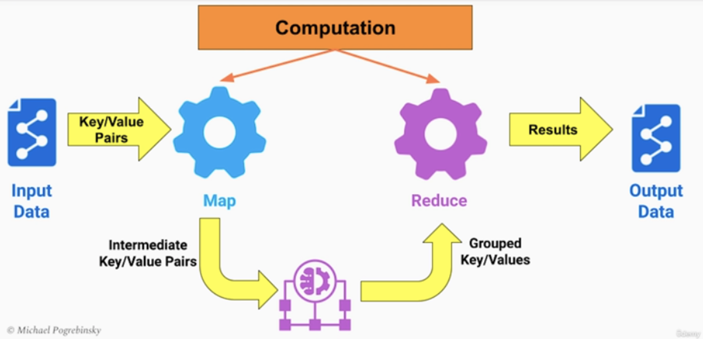
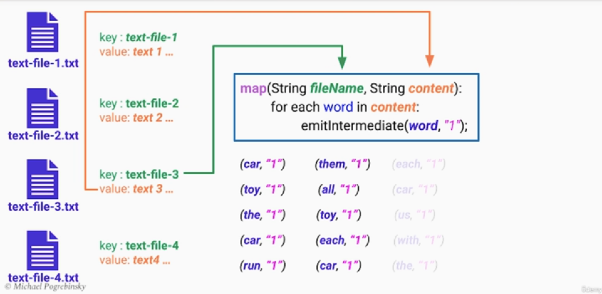
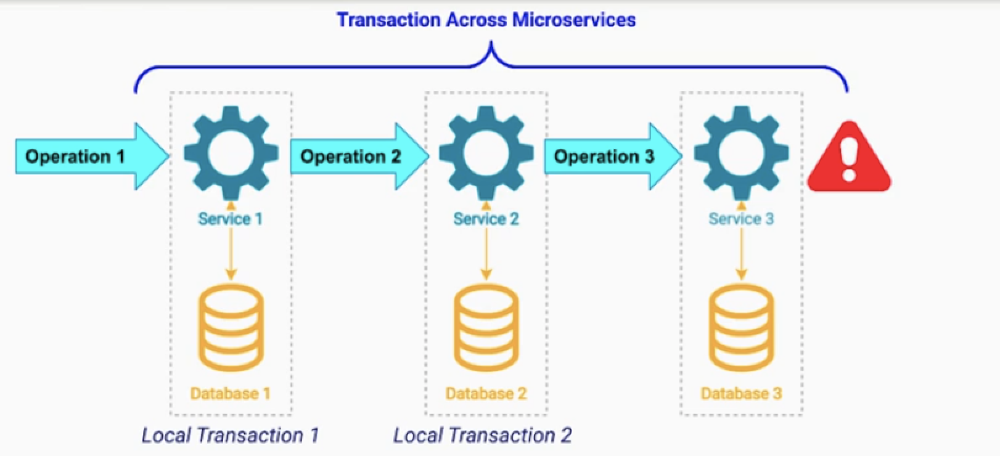
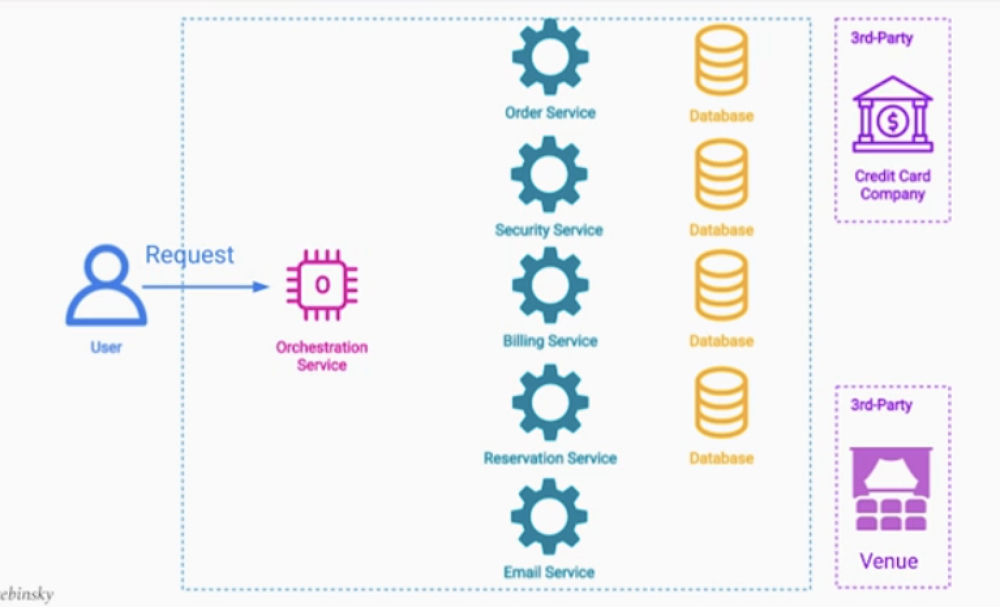

# Cloud SW 아키텍처 패턴:Performance Patterns

- [Cloud SW 아키텍처 패턴:Performance Patterns](#cloud-sw-아키텍처-패턴performance-patterns)
  - [Performance Patterns for Data Intensive Systems](#performance-patterns-for-data-intensive-systems)
  - [Map Reduce Pattern](#map-reduce-pattern)
    - [대용량 데이터 처리의 문제점](#대용량-데이터-처리의-문제점)
    - [MapReduce UseCase](#mapreduce-usecase)
    - [MapReduce 기본 구조](#mapreduce-기본-구조)
    - [MapReduce 예시](#mapreduce-예시)
    - [아키텍처 구조](#아키텍처-구조)
    - [이점](#이점)
    - [실패 및 복구 전략](#실패-및-복구-전략)
    - [고려점](#고려점)
  - [Saga Pattern](#saga-pattern)
    - [문제 및 해결](#문제-및-해결)
    - [Saga Pattern 기본 구조](#saga-pattern-기본-구조)
    - [예시 - 콘서트 티켓 판매 서비스](#예시---콘서트-티켓-판매-서비스)
    - [예시 - 콘서트 티켓 판매 서비스 - 2](#예시---콘서트-티켓-판매-서비스---2)
    - [Saga Pattern 특징](#saga-pattern-특징)
  - [Transactional Outbox Pattern](#transactional-outbox-pattern)
    - [문제점](#문제점)
    - [해결](#해결)
  - [Materialized View Pattern](#materialized-view-pattern)
    - [문제점](#문제점-1)
  - [CQRS Pattern](#cqrs-pattern)
  - [Event Sourcing Pattern](#event-sourcing-pattern)

## Performance Patterns for Data Intensive Systems  
---

데이터 집약 시스템을 위한 성능 패턴을 도입으로 얻는 이점은 무엇일까?  
- 아키텍처 변경없이 대용량 데이터 처리  
- 분산트랙젝션 가능 (ACID 유지)  

 

## Map Reduce Pattern
---

### 대용량 데이터 처리의 문제점  

대용량 데이터 세트 처리의 문제점은 데이터 처리를 위해서 수백~수천 대의 머신에 분산처리 시켜야 하는 점이다.  
- 데이터 병렬화, 데이터 분산 배포, 결과 추합
- 실행 예약, 실패 처리, 복구 문제
- 많은 처리 소스 코드 및 인프라 구성  

맵리듀스 패턴을 사용하면, 아키텍처의 변경없이 많은 양의 데이터를 처리할 수 있는 시스템이 구성된다.  

### MapReduce UseCase  

- 머신러닝
- 로그 파일 필터 및 분석
- 역색인 구성
- 웹링크 그래프 순회
- 분산 정렬  

### MapReduce 기본 구조
  

Input data: key-value 쌍으로 구성된 데이터를 입력  
1. Map : Map를 통과하면 중간 key-value쌍이 나오게 된다.  
2. intermediate data : Map 중간 key-value 결과물 
3. Reduce : Reduce 함수에서 중간 key-value를 grouping하고(정렬) Reduce 로직 수행 후 최종 데이터를 출력한다.
Output data : 최종데이터   
* 사실상 위 구조만 봤을때는 잘 이해되지 않는다.    

### MapReduce 예시 
  

Goal : 수많은 파일들을 분석해서, 특정 단어의 수를 카운트 하자.  

Input data: key는 파일이름, value는 파일 내용물   

1. Map : 각각의 text file을 대상으로 단어의 갯수들을 출력한다. 이는 key-value쌍으로 출력 가능.    
2. intermediate data : 각 파일의 단어수가 적힌 key-value 데이터 셋 

  
3. Reduce : key값이 단어이므로, 단어순으로 정렬를 먼저 한다. 
- 그리고 각 단어들의 갯수를 추합하여 최종 데이터를 출력한다.      
- *리듀스 함수를 통과시키는데 key에 대해서 반복자를 돌린다. 중간키에 대한 값이 많아서 메모리에 한번에 로드 불가능   

Output data : key-value(단어,갯수)의 리스트  

### 아키텍처 구조

  

크게 3가지의 컴포넌트로 구성된다. 마스터노드, 맵워커, 리듀스 워커  

1.마스터 노드 
- 전체 MapReduce 작업 예약 및 컨트롤  
- 전체 데이터를 청크단위로 나누어서, Map Workder들에게 할당한다. (실제 데이터 주는것이 아닌 임무를 부여)  

2.Map Workers  
- Map 함수를 실행하는 수백 ~ 수천개의 컴퓨터  
- 그냥 데이터를 저장하지 않고, Region을 분리해서 저장한다.  
- Region = hash(key) mod R : 을 통해서 어떤 Region에 저장할지 결정 가능하다.  

3.Reduce Workers
- 마스터는 각 Region을 담당하고 있는 워커에게 작업을 분배한다.
- 리듀스 워커가 데이터를 읽어간다. 
- 키를 그룹 및 정렬하는 과정 (셔플링) > Reduce 연산을 수행  

### 이점  

- 같은 SW아키텍처를 재활용할 수 있다. Map,Reduce함수만 바꾸면 된다. 
- 테스크의 스케일링이 가능.  
- 많은 워커에게 평행하게 작업 분배 가능    
- 짧은 시간안에 대용량의 데이터를 처리할 수 있음.  

### 실패 및 복구 전략
- 마스터가 리듀스 워커들을 관찰하며, 실패한 작업을 다시 다른 워커에게 할당
- 맵 워커가 실패한 경우도 다른 워커에게 작업을 할당하며 이때 바뀐 중간 key-value 값위치도 리듀스워커에게 알려야한다.  
- 마스터 워커가 장애날 확률은 적지만, 작업에 대한 상태를 스냅샷을 두거나 백업 마스터를 둔다.  

### 고려점
- 직접 Map,Reduce 아키텍처를 구성할 일은 없다. 
- 오픈소스/클라우드 서비스 이용한다.  
- 클라우드 환경을 이용해서 필요한 만큼 컴퓨터를 대여하고 반납한다.  
  - ㄴ ( on demand | on scheduled Batch )
- 시스템은 구성을 신경스지 않고, 비즈니스에 집중 가능하다.
  - ㄴ 데이터모델링, map-reduce 모델링, execution parameters 정의 ..등  

 

## Saga Pattern
---

### 문제 및 해결

MSA는 빠른 엔지니어링 속도, 확장성 등 이점이 있다.   
- 한가지 중요한 원칙이 마이크로 서비스 하나당 DB가 하나여야 한다.    
- 만약에 여러 팀이 DB커넥션을 맺으면, 모든 변경사항에 대해서 합의가 필요하다.  
- 이는 마이크로 서비스들이 database를 공유하는것은 MSA안티 패턴이다.  

하지만 서비스 마다 DB로 분리하는 순간 ACID 트랜잭션 이라는 특성을 잃게 된다.    
- *리마인드) 트랜젝션 : 외부 옵저버에 단일 작업으로 표시돼야 하는 작업의 시퀀스  
- 분산 환경에서 데이터의 일관성을 유지하는 방법이 saga패턴이다.  

### Saga Pattern 기본 구조

saga 패턴은 다음의 과정을 통해서 분산환경에서 ACID를 유지 힌다. 
- local 트랜젝션1 을 수행하고 다음 서비스에서 트랜젝션 시퀀스를 이어 간다.  
- 그러다 만약 작업이 실패하면, 기존에 수행한 작업을 롤백하기 위한 과정이 있다.  
- 기존 작업에 대한 보상 작업(보상 트랙젝션) 이라고 한다.  
- *트랜젝션 시퀀스가 성공할때까지 위 과정을 반복한다.  

saga 패턴 구현방법  
1. Orchestrator Pattern : 오케스트레이터 서버로 트렉젝션 시퀀스 및 보상 관리
2. Choreography Pattern : 메시지 브로커로 트렉젝션 시퀀스 및 보상 관리

### 예시 - 콘서트 티켓 판매 서비스

요구사항 
- 행사 티켓 및 티켓 전용 좌석을 예약    
- 블랙리스트 상 유저인지 체크 
- 결제금액을 받았는지 체크 
- 고객 1명당 1개 좌석인지 체크

*보상 트렌젝션 : pending상태를 원래상태로 되돌리는 트렌젝션    
*Pivot Operation : pending상태를 성공상태로 바꾸는 작업들  

1.Order Service : 
- 좌석예약 상태로 DB를 업데이트 (pending) 후 이어서 진행  
- pending 상태이므로, 다른 사용자가 같은 자리를 예약 시도 -> 실패 및 retry 안내   
- 만약 트랜젝션이 실패하면 다른 사용자가 이용 가능    

2.Security Service : 사용자가 유효한지 체크  
- 만약 블랙리스트라면 rollback ( > Order Service 보상 )
- 아니라면 이어서 진행

3.Billing Service : 3rd party에 결제 시도  
- 결제 오류라면 rollback ( > Order Service 보상 )
- 아니라면 DB를 업데이트 (pending) 및 결제 (pending) 후 이어서 진행

4.Reservation Service : 3rd party 좌석 예매 시스템  
- 만약 누군가가 이미 예매했다면 rollback ( > Billing Service 보상 > Order Service 보상 )
- 아니라면 좌석 티켓 예약 성공 및 DB업데이트 (reserved)  

5.Pivot Operation 
- Billing Servce : pending > 사용자에게 결제 요청 API > 성공 > charged
- Order Service : panding > purchased 
- Email Service : 결제성공알람  

### 예시 - 콘서트 티켓 판매 서비스 - 2  

위 과정을 메시지 브로커를 통해서 작동하도록 로직을 구성한다.  
- 메시지 브로커를 사용하면 문제점이 있다.  
- ACID가 지켜지지 않는데, 이는 다음패턴에서 해결  

### Saga Pattern 특징    
- 성공,실패 모두 오퍼레이션이 있다.  
- 실패하는 경우 롤백 오퍼레이션 (보상 트렌젝션)    
- 성공하는 경우 피봇 오퍼레이션  

## Transactional Outbox Pattern

### 문제점  

구인구직 추천서비스를 예로들면  
- 사용자가 회원가입 이후, 신규 유저 메시지를 보내야 한다.  
- DB와 메시지 브로커는 단일 트렉젝션이 아니므로, 충분히 신규 회원가입의 메시지를 못받을 수 있다.  
- 특히나 결제관련된 사항이라면, 영원히 결제 pending 일 수 있다.  

### 해결

단일 트랜젝션으로 만드는 방법 

[ 문제점 - outbox service가 메시지를 두번 보내는 경우 ]

메시지 중복이 되더라도 괜찮은 경우 
- 멱등 연산인 경우
- 결제처럼 중복이 일어나면 안되는 경우 - 멱등연산으로 만들면된다. 
- *결제 ID를 부여

[ 문제점 - atomic transaction을 DB에서 지원하지 않는 경우 nosql ]
- document model에 outbox 데이터 자체를 추가하면 된다. 

[ 문제점 - 이벤트의 순서 ]
- outbox테이블에 시퀀스 ID를 부여하는 것 
- 항상 ID가 낮은 순서대로 메시지를 읽어서 처리해야 한다.  

## Materialized View Pattern

### 문제점  

Raw Data Table이 업데이트 되면, View 테이블을 즉시 혹은 스케쥴링된 시간에 업데이트 가능하다.

[ 예시 ]
온라인 교옥 플랫폼

[ 방법 ]
db 테이블로 저장 
redis 로 저장

[ 코멘트 ]
DB조회가 느린 경우 말고도, 서드파티 API가느린 경우에도 사용할 수 있겠다. 

## CQRS Pattern

Command and Query Responsibility Segregation 

[ 트레이드 오프 ]
복잡한 시스템

[ 사례 ]

후기를 읽는 서비스
- 읽기에 최적화되어있다. 
- 특별한 비즈니스 로직 유효성 검사 등 필요없고, 퍼블릭에 공개가능한 데이터만 존재한다.  

리뷰는 비교적 실시간 업데이트를 진행하고 
상품의 평균 리뷰는 스케쥴링을 통해 제공 

[ CQRS + Materialized View ]

1. Message Queue 데이터 싱크
2. Cloud Function 데이터 싱크

## Event Sourcing Pattern

