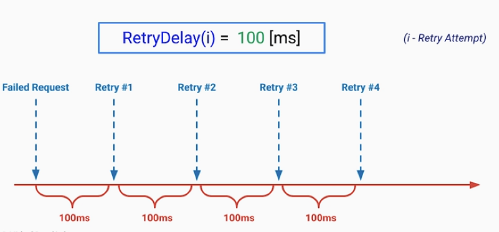
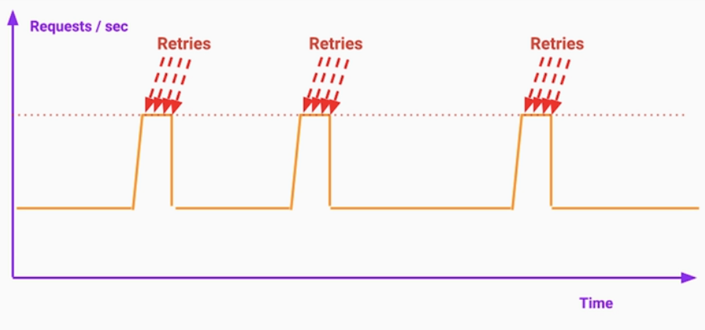

# Cloud SW 아키텍처 패턴:Reliability, Error Handling, Recovery Patterns   

- [Cloud SW 아키텍처 패턴:Reliability, Error Handling, Recovery Patterns](#cloud-sw-아키텍처-패턴reliability-error-handling-recovery-patterns)
  - [Reliability, Error Handling, Recovery Patterns](#reliability-error-handling-recovery-patterns)
  - [Throttling and Rate Limiting Pattern](#throttling-and-rate-limiting-pattern)
    - [문제점 Overconsumption](#문제점-overconsumption)
    - [해결](#해결)
    - [Server Side throttling](#server-side-throttling)
    - [Client Side throttling](#client-side-throttling)
  - [Retry Pattern](#retry-pattern)
    - [문제 정의](#문제-정의)
  - [해결](#해결-1)
    - [애러 카테고리화 - User Error vs System Error](#애러-카테고리화---user-error-vs-system-error)
    - [고려점](#고려점)
  - [Circit Breaker Pattern](#circit-breaker-pattern)
  - [Dead Letter Pattern (DLQ)](#dead-letter-pattern-dlq)

## Reliability, Error Handling, Recovery Patterns

---

4.신뢰성, 오류 처리 및 복구 아키텍처 패턴 - Reliability, Error Handling and Recovery Software Architecture Patterns      

## Throttling and Rate Limiting Pattern

### 문제점 Overconsumption 

클라이언트의 비정상적인 많은 요청이 발생하면 ?  
- 서버의 리소스 소모량이 많아 서버가 죽을수 있다. 이는 서비스 수준 협약 SLA 위반 
- 혹은 오토 스케일링으로 비용 증가  

악의적인 목적이 아니라 데이터 분석을 위해서 다량의 API를 호출하는 경우도 있다.  
- 정시마다 API요청이 피크치는 경우  

### 해결 

Throttling and Rate Limiting  

Throttling : 많은 요청이 들어오면 우선 요청을 대기큐에 넣고, 차근차근 처리하는 로직  
- Request Queue 로 구현 ( Redis, Kafka )

Rate Limiting : 많은 요청이 들어오면, 일부 요청이상은 버리는 로직  
- Redis, InMemory 등으로 구현    
- 예) QPS 30 으로 API 제한

### Server Side throttling 

시스템의 과소비를 막는 방법  
- 제공된 할당량이 이상으로 처리하지 않도록 제한  
- 예) 분당 1G의 송수신 이상은 처리하지 않는다.  

### Client Side throttling

클라이언트측의 제한을 두는 방법. 이는 여러가지 전략들을 구사할 수 있다.   

1.Dropping Reqeust : 429 Too Many Reqeust 요청으로 응답한다.   
- 주가 데이터를 요청하는 API를 너무많이 요청하는 클라이언트에게, 해당 응답값을 보내준다.  

2.Request Queue : 요청이 들어오면 대기열에 들어간다.  
- 추후 처리를 해준다.  
1+2. 모든 요청들을 큐에다 담아서 처리를하면서, 일일 요청에 제한을 넘은것들은 드랍  

3.Reduce Quality / Limit Bandwith
- 저화질로 영상 콘텐츠 및 오디오 제공 

Global Rate Limit 정책  

- 특정 IP에 대해서 Rate Limiter를 거는 방법 
- 일부 API 혹은 UserId별로 Rate Limiter를 거는 방법   
- 요금제에 따라서 Rate Limiter를 거는 방법   
- 서비스 별로 Rate Limiter를 거는 방법 (채권,주식,ETF 등)  

## Retry Pattern

### 문제 정의 

외부 리소스의 요청은 항상 다음을 생각해야 한다.  
- Success  
- Fail with ErrorMsg, Fail with no Msg, Timeout, Delay  

## 해결

Retry 로직을 구현하면 된다.  
비교적 간단하지만 몇가지 오려해야 할 사항들이 있다.  

### 애러 카테고리화 - User Error vs System Error 

사용자 애러인가 ? 시스템 애러인가 구분 
- 403 Not Authorized 애러는 사용자의 권한이 없다는 것이다.  
- 이는 사용자에게 애러에 대한 적절한 피드백이 가능  
- 500 Internal Error는 시스템 내부의 오류로 발생  
- 사용자에게 오류정보는 드러내면 안된다.  

### 고려점

1.어떤 오류일때 재시도할지 선택  
- 503 Service Unavailable 애러라면 성공할때까지 몇번 더 요청할 수 있다.  
- LB를 통해 정상적인 서버에 도달할 수 있음  

2.지연 및 Backoff 전략 
- retry storm으로 전체 서비스 장애로 퍼지는 경우가 있다.  
- 모종의 이유로 서버 10대 중 2대가 장애  
- retry횟수가 증가하면서 증가한 트래픽이 나머지 8대 서버에게 장애를 일으키는 경우  
- 재시도 사이에는 적절한 딜레이가 필요하다.  

Strategies:

• Fixed Delay
• Incremental Delay
• Exponential Backoff

3.랜덤화 및 지터 Jitter 추가  
- 모든 서버가 3초후 retry를 동시다발적으로 하면, 장애로 번질 수 있다.  
- Jitter라는 약간의 랜덤화 변수를 추가할 수 있다.   

4.재시도 횟수와 시간  
- 일정 오류의 트리거가 넘으면 애러를 알려야 한다. on-call

5.재시도 작업의 멱등성
- 결제같은 경우, 결제 요청을 서버에게 보냈는데 응답이 안왔다.  
- 1.결제 서버가 실제 처리하고 있고, 응답만 못해준 경우  
- 2.결제 서비가 메시지 자체를 못받은 경우  
- 이런 경우 다시 retry해서 중복결제가 발생하면 안된다.  

6.retry 로직실행 위치
- 라이브러리 공통 모듈화 
- ambassador sidecar 패턴을 이용  

## Circit Breaker Pattern

## Dead Letter Pattern (DLQ)
