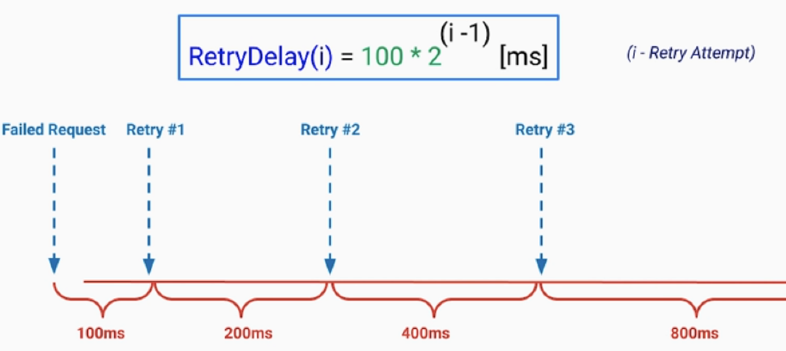
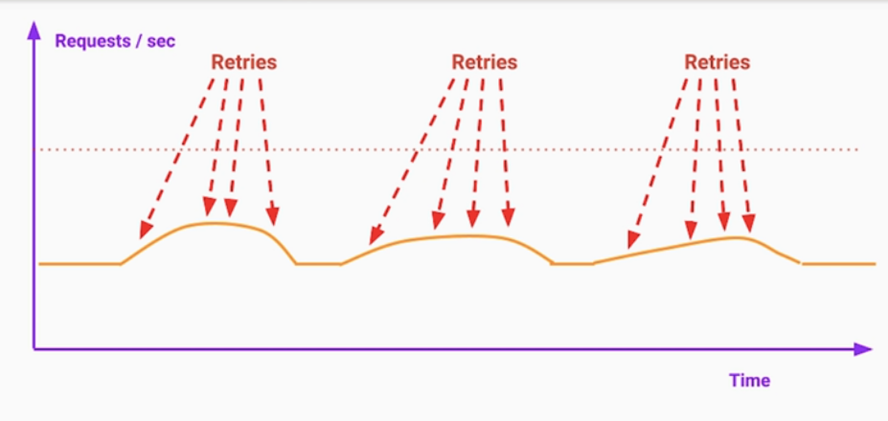
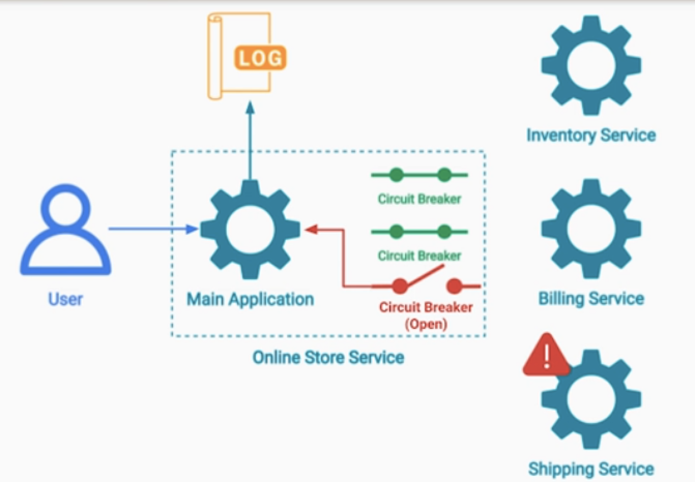
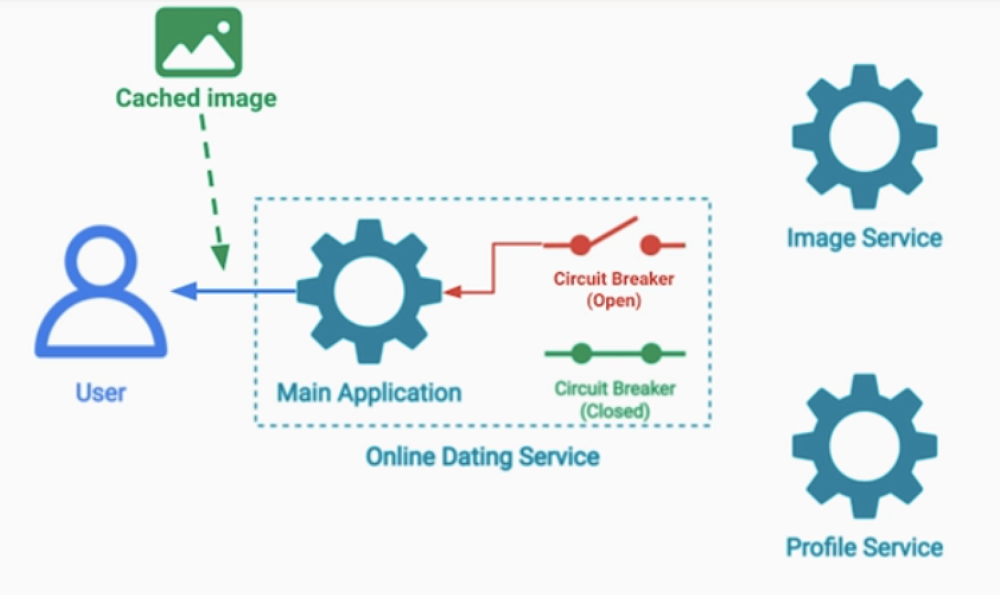
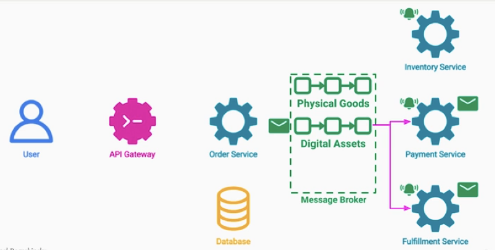

# Cloud SW 아키텍처 패턴:Reliability, Error Handling, Recovery Patterns   

- [Cloud SW 아키텍처 패턴:Reliability, Error Handling, Recovery Patterns](#cloud-sw-아키텍처-패턴reliability-error-handling-recovery-patterns)
  - [Reliability, Error Handling, Recovery Patterns](#reliability-error-handling-recovery-patterns)
  - [Throttling and Rate Limiting Pattern](#throttling-and-rate-limiting-pattern)
    - [문제점 Overconsumption](#문제점-overconsumption)
    - [해결](#해결)
    - [Server Side throttling](#server-side-throttling)
    - [Client Side throttling](#client-side-throttling)
  - [Retry Pattern](#retry-pattern)
    - [문제 정의](#문제-정의)
  - [해결](#해결-1)
    - [애러 카테고리화 - User Error vs System Error](#애러-카테고리화---user-error-vs-system-error)
    - [고려점](#고려점)
  - [Circit Breaker Pattern](#circit-breaker-pattern)
    - [문제점](#문제점)
    - [해결법](#해결법)
    - [고려점](#고려점-1)
  - [Dead Letter Queue Pattern (DLQ)](#dead-letter-queue-pattern-dlq)
    - [문제점](#문제점-1)
    - [해결](#해결-2)
    - [사례](#사례)

## Reliability, Error Handling, Recovery Patterns

---

4.신뢰성, 오류 처리 및 복구 아키텍처 패턴 - Reliability, Error Handling and Recovery Software Architecture Patterns      

## Throttling and Rate Limiting Pattern

### 문제점 Overconsumption 

클라이언트의 비정상적인 많은 요청이 발생하면 ?  
- 서버의 리소스 소모량이 많아 서버가 죽을수 있다. 이는 서비스 수준 협약 SLA 위반 
- 혹은 오토 스케일링으로 비용 증가  

악의적인 목적이 아니라 데이터 분석을 위해서 다량의 API를 호출하는 경우도 있다.  
- 정시마다 API요청이 피크치는 경우  

### 해결 

Throttling and Rate Limiting  

Throttling : 많은 요청이 들어오면 우선 요청을 대기큐에 넣고, 차근차근 처리하는 로직  
- Request Queue 로 구현 ( Redis, Kafka )

Rate Limiting : 많은 요청이 들어오면, 일부 요청이상은 버리는 로직  
- Redis, InMemory 등으로 구현    
- 예) QPS 30 으로 API 제한

### Server Side throttling 

시스템의 과소비를 막는 방법  
- 제공된 할당량이 이상으로 처리하지 않도록 제한  
- 예) 분당 1G의 송수신 이상은 처리하지 않는다.  

### Client Side throttling

클라이언트측의 제한을 두는 방법. 이는 여러가지 전략들을 구사할 수 있다.   

1.Dropping Reqeust : 429 Too Many Reqeust 요청으로 응답한다.   
- 주가 데이터를 요청하는 API를 너무많이 요청하는 클라이언트에게, 해당 응답값을 보내준다.  

2.Request Queue : 요청이 들어오면 대기열에 들어간다.  
- 추후 처리를 해준다.  
1+2. 모든 요청들을 큐에다 담아서 처리를하면서, 일일 요청에 제한을 넘은것들은 드랍  

3.Reduce Quality / Limit Bandwith
- 저화질로 영상 콘텐츠 및 오디오 제공 

Global Rate Limit 정책  

- 특정 IP에 대해서 Rate Limiter를 거는 방법 
- 일부 API 혹은 UserId별로 Rate Limiter를 거는 방법   
- 요금제에 따라서 Rate Limiter를 거는 방법   
- 서비스 별로 Rate Limiter를 거는 방법 (채권,주식,ETF 등)  

## Retry Pattern

### 문제 정의 

외부 리소스의 요청은 항상 다음을 생각해야 한다.  
- Success  
- Fail with ErrorMsg, Fail with no Msg, Timeout, Delay  

## 해결

Retry 로직을 구현하면 된다.  
비교적 간단하지만 몇가지 오려해야 할 사항들이 있다.  

### 애러 카테고리화 - User Error vs System Error 

사용자 애러인가 ? 시스템 애러인가 구분 
- 403 Not Authorized 애러는 사용자의 권한이 없다는 것이다.  
- 이는 사용자에게 애러에 대한 적절한 피드백이 가능  
- 500 Internal Error는 시스템 내부의 오류로 발생  
- 사용자에게 오류정보는 드러내면 안된다.  

### 고려점

1.어떤 오류일때 재시도할지 선택  
- 503 Service Unavailable 애러라면 성공할때까지 몇번 더 요청할 수 있다.  
- LB를 통해 정상적인 서버에 도달할 수 있음  

2.지연 및 Backoff 전략 
- retry storm으로 전체 서비스 장애로 퍼지는 경우가 있다.  
- 모종의 이유로 서버 10대 중 2대가 장애  
- retry횟수가 증가하면서 증가한 트래픽이 나머지 8대 서버에게 장애를 일으키는 경우  
- 재시도 사이에는 적절한 딜레이가 필요하다.  

Strategies:

• Fixed Delay
• Incremental Delay
• Exponential Backoff

3.랜덤화 및 지터 Jitter 추가  
- 모든 서버가 3초후 retry를 동시다발적으로 하면, 장애로 번질 수 있다.  
- Jitter라는 약간의 랜덤화 변수를 추가할 수 있다.   

4.재시도 횟수와 시간  
- 일정 오류의 트리거가 넘으면 애러를 알려야 한다. on-call

5.재시도 작업의 멱등성
- 결제같은 경우, 결제 요청을 서버에게 보냈는데 응답이 안왔다.  
- 1.결제 서버가 실제 처리하고 있고, 응답만 못해준 경우  
- 2.결제 서비가 메시지 자체를 못받은 경우  
- 이런 경우 다시 retry해서 중복결제가 발생하면 안된다.  

6.retry 로직실행 위치
- 라이브러리 공통 모듈화 
- ambassador sidecar 패턴을 이용  

## Circit Breaker Pattern

### 문제점  

Retry 패턴으로 단기적 오류로 낙관적인 처리다.  
- 타임아웃 발생, 서버 crash로 재시작 중, 네트워크 이슈  

하지만 외부 서버가 장기적 오류인 케이스가 있다.   
- 긴 시간동안, 일시적이지 않은, 회복 불가능한 경우  

### 해결법

서킷 브레이커 패턴으로 해결한다.  
- 회로의 차단이라는 의미이다. 비유하자면 두꺼비집, 퓨즈   
- 애러 비율이 높아지는 순간, 메인 서버를 보호 혹은 더이상 요청을 보내지 않기 위해 회로를 Open 한다.  
- 그러면 더이상 Image Service에 요청을 보내지 않는다.  
- Main 서버의 일부 기능이 다운 되더라도, 더 큰 장애로 퍼지지 않도록 한다.  

- 평생 회로를 열어두지는 않는다.  
- 일정 시간이 흐른다면, 약간의 요청을 보내는 Half-Open 상태가 있다.  
- 여기서 많은 오류가 발생하면 다시 Open 상태로 전이되고
- 그렇지 않다면 Closed 상태로 전이 된다.  

### 고려점  

1.서킷브레이커로 처리하지 못한 요청에 대한 후처리
- 이커머스 서비스의 경우에  
- 사용자의 주문으로 재고 감소, 결제까지 발생되었다. 하지만 배송서비스까지는 전달 되지 않음  
- 그러면 배송서비스 전달 못한 부분은 로그를 남겨서 추후 처리하도록 한다.  

2.서킷브레이커로 실패에 대한 처리

2.1 fail silently
- 데이팅 서비스에서 서킷브레이커로 사용자 이미지를 못받는 경우  
- 기본 이미지로 대신할 수 있다.  

2.2 best effort 
- 데이팅 서비스에서 서킷브레이커로 사용자 이미지를 못받는 경우  
- 최신 이미지는 아니더라도, 캐시된 데이터의 이미지로 대신할 수 있다.  

3.각 서비스마다 서킷브레이커를 두는 것  
- 서비스 하나가 다운되어서, 더 이상의 진행을 막지 않도록 처리해 두는 것  

4.Half-Open 상태에서는 health-check API를 전송하는 것
- 핑 체크로도 서킷을 닫을 수 있다. 리소스를 절약할 수 있다.    

5.서킷브레이커를 어디에 구현할지?
- 5.1 in server
- 5.2 ambassador sidecar

## Dead Letter Queue Pattern (DLQ)

### 문제점

카프카 같은 메시지 브로커를 이용한, 이벤트 드리븐 아키텍처는 많은 이점이 있음  
- 서버간의 디커플링 ( 프로듀서, 컨슈머 ) 
- 스케일 확장성 좋음  
- 비동기적 통신 및 처리 가능  

하지만 애러 처리 역시 까다롭다.   
- 잘못된 토픽이 오는 경우
- 토픽이 없는 경우
- 용량이 다 차서 메시지를 못받는 경우  

예) 주문 처리 서비스에서 큐의 특정 메시지를 읽을 때  
- 계속해서 데이터 파싱 문제가 발생 하는 것  
- 이를 모르고, 계속해서 retry로 메시지를 보내는 경우가 발생  
- 정상적으로 처리가능한 메시지가 지연될 수 있다.  
- 처리 불가능한 메시지로 큐가 계속 채워지는 이슈가 발생할 수 있다.  

### 해결

데드 레터 큐를 도입 한다.  
- 이는 메시지 브로커의 특수한 토픽이다.  
- 보내는 방법은 2가지 이다.  

Programmatic Publising
- 1.퍼블리셔 : 적절한 토픽이 없는경우 데드래터큐에 보낸다.  
- 2.컨슈머 : 토픽을 적절하게 처리할 수 없는경우 다시 데드래터큐에 발행한다.  

Automatic transfer  
- 1.약속되지 않은 토픽을 받으면, 데드레터큐에 보낸다.  
- 2.특정 메시지가 아무도 읽지 않고 오래 있는 경우, 메시지 삭제 후 데드레터큐에 보낸다.  
- *이는 메시지 브로커에서 지원 가능 여부 확인 할 것

Dead Letter 로 보낼때 적절한 애러 메시지나 코드등을 넣어주는것이 중요하다.  

### 사례  

사용자가 장바구니에 상품을 담았다.  
- 장바구니에 담긴 상품은 주문 가능하다.  
- 해당 상품은 카탈로그가 변경되어 이제 장바구니에 넣는것이 불가능 하다.  
- 사용자가 한달 후 상품을 주문한다. 
- 카탈로그가 삭제된 상품에 대해서 재고 처리를 할 수 없는 이슈 발생  
- 해당 이슈는 데드래터큐에 들어간다.  
- 이를 모니터링 하는 관리자들이 수동으로 처리해준다. (환불 등 조치)   

