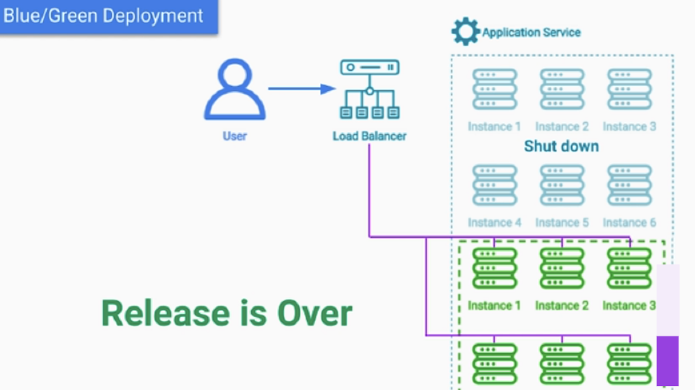

# Cloud SW 아키텍처 패턴:Deployment and Production Testing Patterns

- [Cloud SW 아키텍처 패턴:Deployment and Production Testing Patterns](#cloud-sw-아키텍처-패턴deployment-and-production-testing-patterns)
  - [Deployment and Production Testing Patterns](#deployment-and-production-testing-patterns)
  - [Rolling](#rolling)
  - [Blue-Green](#blue-green)
  - [Canary A/B](#canary-ab)
  - [Chaos Engineering Pattern](#chaos-engineering-pattern)
    - [Chaos Engineering - Motivation](#chaos-engineering---motivation)

## Deployment and Production Testing Patterns   

5.배포 및 프로덕션 테스트 아키텍처 패턴 - Deployment and Production Testing Patterns    

## Rolling 

- Rolling Deployment benefits:
  - No downtime
  - No additional cost for hardware
  - We can rollback quickly if something goes wrong  

- Downsides:
  - Potential for Cascading Failures
  - 2 versions in production at the same time

## Blue-Green

## Canary A/B

Both Canary Release and A/B Deployment Patterns allow us
- to dedicate a small portion of servers for a different version of software

During a Canary Release:
- We monitor for:
  - Performance
  - Functionality
- Limit to internal users or beta testers

## Chaos Engineering Pattern

### Chaos Engineering - Motivation  

• We won't know about those issues until they actually happen 
• When they do happen it may be too late  
• Those issues are very rare  
• The results of those issue can be catastrophic  
• Solution of Chaos Engineering : Embracing the inherent chaos in a cloud-based 
  Distributed System  

Chaos Monkey (2011) by Netflix  
• Responsible for randomly terminating cloud servers in production

- Chaos Engineering Pattern:  
  - Increases confidence  
  - Protects production against critical failures   

- Allows finding: 
  - Single Points of Failure   
  - Scalability issues  
  - Performance bottlenecks   

- Ensures that real failures are dealt with gracefully  