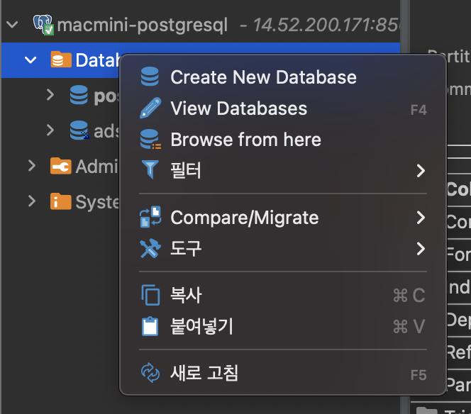

# NestJS PostgreSQL 설치

<head>
  <meta name="keywords" content="NestJS,TypeORM"/>
</head>

## Goal

PostgreSQL DB를 설치하고 DBeaver 클라이언트로 연결해보자.   
내부적으로 TypeORM을 사용해서 모델링과 CRUD 로직을 작성해본다.  

## 설치 방법 

1. PostgreSQL 서버를 직접 로컬 머신에 설치  
2. PostgreSQL Docker로 설치  

## 1번 방법 - PostgreSQL 서버 설치  

컴포넌트 구성    

PostgreSQL Server : DBMS 서버  -- 필수 (Server)  
postgres CLI client : CLI DB 클라이언트 프로그램 (Client)  
PgAdmin4 : GUI DB 관리 프로그램 (Client)  
DBeaver : GUI DB 관리 프로그램 (Client)  

- 옵션 : StackBuilder : Workbench같은 SQL 작성 툴인 듯 ? 
- *주의 : 버전 통일 (  v13 으로 Server, Client 맞출 것) 

download --> https://www.postgresql.org/    
	- PostgreSQL Server + pgAdmin 설치 가능  
	- 비번 : <password>
	- 포트 : 5433

### postgres

postgres 명령어는 : SQL Server를 실행시키고 관리하는 명령이다.
- SSL, connection수 등 관리가능

```
>postgres --version
postgres (PostgreSQL) 13.0
```

### psql

psql은 PostgreSQL 대화식 터미널입니다 (CLI 클라이언트).  
>psql --help. 
- postgres, psql 위 두 명령어 환경변수 등록이 필요하다. 

```
>psql --host=localhost --port=5433 --username=postgres

postgres 사용자의 암호:
psql (13.0)
도움말을 보려면 "help"를 입력하십시오.
postgres=#
```


## 2번 방법 - Docker postgres:13 install

### yml file setup

```yml
# .env
POSTGRES_VOLUME_DIR= VOLUME_DIR
POSTGRES_PASSWORD=PASSWORD
---
# docker-compose.yml
version: "0.2"

services:
  postgres_db:
    image: postgres:13
    container_name: postgres_db
    restart: always
    volumes:
      - ${POSTGRES_VOLUME_DIR}:/var/lib/postgresql/data
    ports:
      - "8500:5432"
    environment:
      - POSTGRES_PASSWORD=${POSTGRES_PASSWORD}

```

### container run

```
docker compose up -d 
```

### check ping

```
docker exec -it postgres_db bash
psql --username=postgres

# \dt
        List of relations
 Schema | Name | Type  |  Owner   
--------+------+-------+----------
 public | user | table | postgres
(1 row)

```

## PostgreSQL에서 데이터베이스(Database), 스키마(Schema), 테이블(Table)의 관계

1. **데이터베이스(Database):**
   - 데이터베이스는 정보를 구조화하고 저장하는 공간입니다.
   - 여러 개의 데이터베이스가 PostgreSQL 서버에 존재할 수 있습니다.

2. **스키마(Schema):**
   - 스키마는 데이터베이스 내의 논리적인 구조를 정의합니다.
   - 스키마 안에는 여러 개의 테이블, 뷰, 함수 등이 포함될 수 있습니다.
   - 각 데이터베이스는 여러 개의 스키마를 가질 수 있습니다.

3. **테이블(Table):**
   - 테이블은 실제 데이터가 저장되는 곳입니다.
   - 테이블은 특정 스키마 내에 속하며, 열(Column)과 행(Row)의 형태로 데이터를 저장합니다.

간단히 말하면, 데이터베이스는 여러 개의 스키마를 포함하고, 각 스키마는 여러 개의 테이블과 다른 객체를 가질 수 있어요. 이러한 구조는 데이터를 조직화하고 관리하는 데 도움이 됩니다.


## DB 만들기  

### DBeaver



1. connection 정보 입력 후 DB 접속
2. Create New Database


## ref


https://docs.nestjs.com/techniques/database#database  
https://www.npmjs.com/package/typeorm  