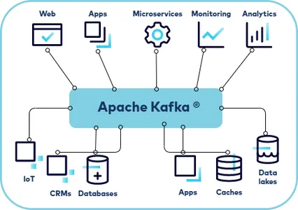
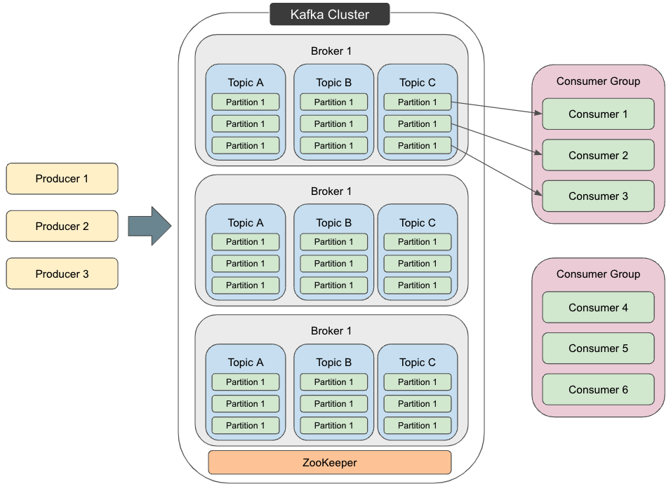

# 초보자를 위한 kafka-1 소개

## 카프카 소개

  

### 문제 정의

기업의 MSA 환경에서는 수많은 서버들이 존재한다.  
- 서버간 데이터를 주고 받을때 간단한 시스템이면 쉽다.   
- 하지만 수십개의 시스템이 서로 엉킨 상태로 데이터의 흐름이 발생하는 시스템이라고 생각해보면  
- 매우 복잡하고, 유지 비용이 기하급수적으로 증가한다.  

데이터를 주고받는 프로토콜도 매우 다양하다.  
- TCP, HTTP, REST, FTP, RPC, JDBC 등등

데이터를 보내는 포멧도 매우 다양하다.  
- 바이너리, CSV, JSON, XML, protobuf

특히나 데이터 스키마가 변경되면 , 이에 의존하고 있는 서버들까지 장애가 번질 수 있음 

### 해결 (카프카)

카프카라는 컴포넌트로 서버간에 디커플링을 도입한다.  

  

- 카프카는 링크드인에서 만든 오픈소스 이다. 
- 분산환경에서, 회복력이 있는, 장애 허용 아키텍처 이다. 
- 수평확장성이 좋다.
  - 메세지 브로커의 수를 늘릴 수 있다.
  - 초당 메시지 전달을 수백만건이 가능하다.  
- 실시간 / 고성능으로 메시지 전달이 가능 ( 레이턴시 10ms 미만 )

### usecase 및 사례

usecase
- 메시징 시스템  
- 유저 활성화 추적  
- 다른 지역의 메트릭을 수집  
- 어플리케이션의 로그 수집  
- 스트림 프로세싱  
- 시스템간의 디커플링  
- 스파크, 하둡 등의 많은 빅데이터 플랫폼과 통합이 가능  
- pub/sub 마이크로 서비스   

사례  
- 넷플릭스 : 유저가 영상 시청중에 실시간으로 다음 추천 영상 업데이트 서비스 
- 우버 : 사용자,택시,여행데이터를 실시간 수집 및 수요 예측 서비스
- 링크드인 : 스팸 방지 서비스, 사용자 상호작용 데이터 수집으로 관계 추천 서비스

## 코드 자료 

https://www.conduktor.io/apache-kafka-for-beginners/

