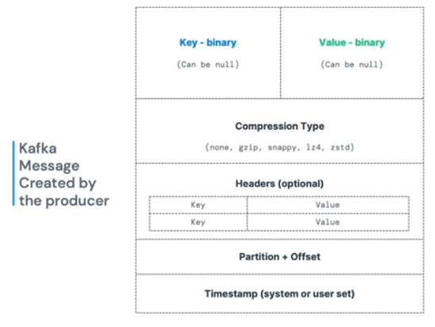

# 초보자를 위한 apache kafka - 2

- [초보자를 위한 apache kafka - 2](#초보자를-위한-apache-kafka---2)
  - [1. 토픽, 파티션 오프셋](#1-토픽-파티션-오프셋)
    - [예](#예)
  - [2. 프로듀서 \& 메시지 키](#2-프로듀서--메시지-키)
    - [메시지 구조](#메시지-구조)
    - [Kafka Message Serializer](#kafka-message-serializer)
    - [Kafka Message Key Hashing](#kafka-message-key-hashing)
  - [3. 컨슈머 \& 역직렬화](#3-컨슈머--역직렬화)
    - [Consumer Deserializer](#consumer-deserializer)
  - [4. 컨슈머 그룹 \& 컨슈머 오프셋](#4-컨슈머-그룹--컨슈머-오프셋)
    - [Delivery semantics for consumers](#delivery-semantics-for-consumers)
  - [브로커 \& 토픽](#브로커--토픽)
  - [토픽 복제](#토픽-복제)
  - [프로듀서 확인 \& 토픽 내구성](#프로듀서-확인--토픽-내구성)
  - [주키퍼](#주키퍼)
  - [Kafka KRaft - 주키퍼 지우기](#kafka-kraft---주키퍼-지우기)


## 1. 토픽, 파티션 오프셋


토픽이란 : 데이터 스트림의 일부분.  
- 카프카는 클러스터 환경에서 구동된다. 즉 여러개의 노드로 구성된다. 
- 카프카 안에는 여러가지 토픽들이 존재한다.  
- db로 비유하면 여러 테이블이 존재하는것과 동일하다. 
- 다양한 토픽들을 생성할 수 있고, 토픽은 이름은 식별자이므로 중복되지 않는다.  
- 어떠한 메시지 포멧도 받으며, 토픽들은 컨슈머나,프로듀서에서 쿼리할 수 없다.  
- 토픽 안에는 메시지들의 시퀀스가 존재한다. 그래서 카프카를 스트리밍 플랫폼이라고 한다.  

파티션  
- 토픽안은 또 여러개의 파티션으로 분리된다. 예를들어 하나의 토픽에 100개의 파티션이 존재할 수 있다.  
- 메시지시들은 각 파티션에 들어가며, id값을 증가시키며 들어간다.  
- 카프카의 토픽은 불변성을 가지고 있다. 그래서 메시지를 한번 넣으면 수정이나 삭제가 불가능 하다.  
- 메시지는 불변성이나, 디폴트로 1주일 후에 사라진다.  

오프셋 
- 메시지들의 id를 파티션의 오프셋이라고 한다.  

### 예

truck_gps 라는 토픽이 있다고 예를 들어 본다.   
- 수많은 트럭들이 존재하고, 20초마다 gps 위치정보를 카프카에 전송하는 상황이다. 
- 각 트럭은 truckID, truckPosition 데이터가 있다.
- 이 토픽을 구독하고 있는 서비스는, location map / notification service 이다.

<br/>

## 2. 프로듀서 & 메시지 키

프로듀서 : 토픽에 메시지를 보내는 주체이다. 
- 토픽에는 파티션이 존재하고, 프로듀서는 어느 파티션에 메시지를 쓸지 알고 있다.  
- 만약에 카프카 브로커가 메시지 수신에 실패하면, 프로듀서가 리커버리 해야한다. 

메시지 키 
- 프로듀서가 메시지를 보낼때는 키라는 메타데이터와 함께 보낸다.  
- 메시지는 string, number, binary 등이 될 수 있으며 null도 가능하다.  
- null값인 경우에는 임의의 파티션에 메시지가 기록된다.  
- null값이 아닌 경우에는, 메시지는 특정 파티션에 기록된다.   
- 파티션에 들어가기 전에 해시함수가 있다. 그래서 특정 키값은 언제나 같은 파티션에 들어간다.  
- 만약에, 트럭ID를 키값으로 사용하고, gps정보를 계속 보낸다면 이 메시지는 동일한 파티션에 모두 들어간다.  

### 메시지 구조



카프카의 메시지 구조는 위 그림과 같다.   
- key : 바이너리, nullable
- value : 바이너리, nullable
- compression Type : 압축 매커니즘 적용 가능
- headers : optional 
- partition + offset
- timestamp

### Kafka Message Serializer  

카프카는 오직 bytes 만 입출력이 허용된다.  
- 프로듀서와 컨슈머는 데이터를 시리얼라이즈 해야한다.  
- 여기서 시리얼라이즈라는 말은, 바이너리(0,1)형태로 데이터를 변환해야 한다.  
- string (json포함), int, float, protobuf 등 모두 바이너리 데이터로 바꾸어야 한다.  

### Kafka Message Key Hashing 

카프카 파티셔널 로직에서 사용되는 해싱로직은 marmar2 알고리즘이다.  
- ```targetPartition = Math.abs(murmur2(keyBytes)) % (numPartitions - 1)  ```  
- 카프카의 레코드에서 위 해싱 로직을 태우고, 파티션에 전달하는 과정이 내부적으로 존재  
- 중요한점은 프로듀서도 어느 파티션에 데이터가 저장될지 알고 있다.  

<br/>

## 3. 컨슈머 & 역직렬화

컨슈머는 토픽의 메시지를 읽는데, pulling방식으로 데이터를 읽는다.  
- 컨슈머는 자동으로 어떤 파티션에서 데이터를 읽을지 알고 있다.  
- 브로커가 장애가 발생했을때도, 리커버리 방식도 알고있다. 
- 데이터는 낮은 오프셋에서 높은 오프셋으로 읽는데, 어떤 파티션에서 먼저 읽는지는 순서가 보장되지 않는다. 

### Consumer Deserializer 

컨슈머는 데이터를 읽고나면 Deserializer 과정이 있다.  
- 바이너리 값인 키값은 정수로 변환하고, 바이너리 값인 value는 string으로 변환하는 등의 작업이 있다.  
- 조립과 분해의 과정처럼 Serializer-Deserializer 과정이 있는것이다.
- 그래서 topic lifecyle 안에는 데이터의 타입이 변경되면 안된다.  
- 데이터 타입의 변경이 필요한 경우에는 새로운 토픽을 만들어야 한다.  

<br/>

## 4. 컨슈머 그룹 & 컨슈머 오프셋


컨슈머 그룹 : 모든 컨슈머는 그룹을 만들어서 데이터를 소비한다.  
- 각 컨슈머는 파티션을 독점적으로 읽는다.   
- 동시에 여러 컨슈머가 동일한 파티션을 읽지 않는다.  
- 만약에 파티션보다 컨슈머가 더 많다면, 비활성화된 컨슈머 그룹이 생긴다.  


위 그림은 n개의 컨슈머, m개의 컨슈머 그룹, k개의 파티션에 대한 그림니다.  
- 파티션은 여러 컨슈머 그룹을 가질 수 있다.  
- 하지만, 한개의 파티션은 그룹당 하나의 컨슈머만 읽어간다.  
- 예) 트럭 위치정보 토픽&파티션을 읽어가는 서비스들이라면, 
  - 1번 컨슈머 그룹 : 위치 서비스에 사용
  - 2번 컨슈머 그룹 : 알림 서비스에 사용 

컨슈머 오프셋 : 데이터를 어디까지 읽었는지 북마크 같은 기능 
- 카프카가 오프셋 정보를 컨슈머 그룹별로 저장하고 있다.  
- 오프셋 정보는 토픽에 커밋된다. __consumer_offsets 이라는 변수명  
- 만약 컨슈머가 죽게된다면, 어디까지 읽었는지 기록을 두었으니 이어서 읽게 된다.  

### Delivery semantics for consumers

기본적으로 자바 컨슈머는 at least once로 자동 커밋된다.  
- 3가지 다른 옵션들이 있다.  

1.at least once : 최소한 한번 / 보통의 경우에 추천된다.   
- 메시지를 읽고나면 오프셋이 커밋된다.  
- 메시지를 다시 읽을 기회가 주어진다. 따라서 멱등의 경우에만 사용해야 한다.  

2.at most once : 최대한 한번 
- 컨슈머가 메시지를 받자마자 오프셋을 커밋하게 된다.  
- 만약에 메시지에 대한 일처리가 잘못되면, 일부 메시지를 잃을 수 있다.  
- 잘못된 처리를 되돌리기전에 이미 커밋을 해버린 상황이니까  

3.exactly once : 정확히 한번
- 토픽을 읽고 잘 처리가 되면 트랜젝션 API를 호출해서 커밋한다.  
- 외부시스템으로 가는 경우에는 멱등 컨슈머를 사용한다 ? 

<br/>

## 브로커 & 토픽
<br/>

## 토픽 복제 
<br/>

## 프로듀서 확인 & 토픽 내구성
<br/>

## 주키퍼 
<br/>

## Kafka KRaft - 주키퍼 지우기


