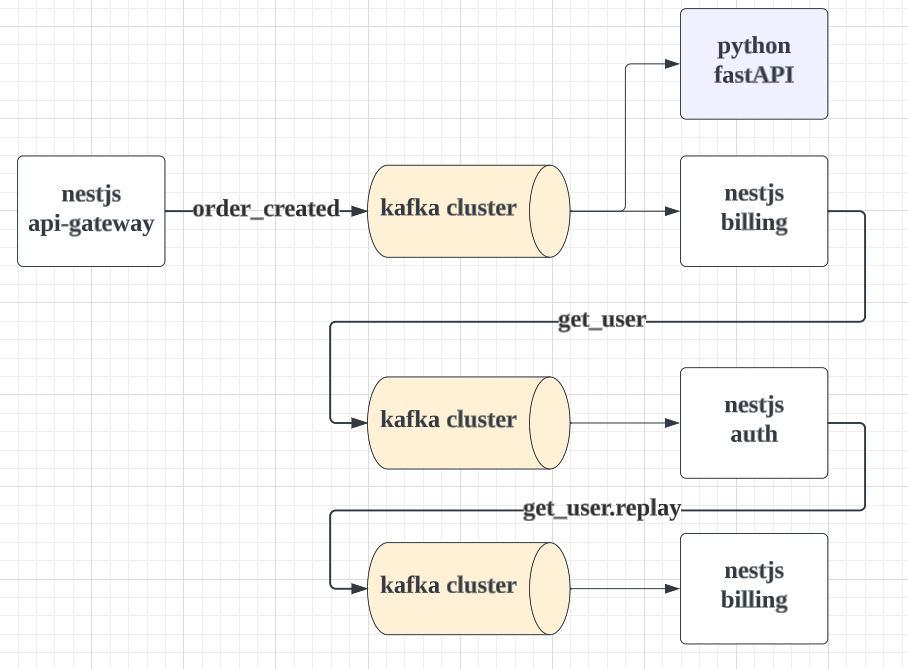

# kafka example with nestjs, python


## what to do



### 구성 = nestjs 서버 3 + python 서버 1 
1. nestjs-api-gw
2. nestjs-billing
3. nestjs-auth
4. python-fastAPI

### 절차  
1 nestjs-api-gw 가 order_created 토픽에 사용자 주문관련 메시지 발행
2 nestjs-billing 가 메시지를 받아서 처리한다. get_user라는 토픽을 발행 및 토픽을 구독 
3 nestjs-auth 가 get_user 토픽의 메시지를 받아서 내용을 리턴한다. (이는 get_user.reply 토픽으로 발행됨 )  
4 nestjs-billing 가 응답을 받는다.  
5 python-fastAPI가 1번에 의해, order_created 토픽에 발행된 메시지를 받고 콘솔 출력 한다.   

### 추가 설명  
1번 절차에서는 메시지를 단방향으로 흐르게 했다. emit 함수로 보내고 EventPattern 으로 받는다.  
2번 절차에서는 메시지를 양뱡향으로 주고받게 했다.  
- 내부적으로는 2개의 토픽으로 단방향으로 구현된다.  
- 송신자 : 어플리케이션에서는 send, subscribe라는 메서드로 바인딩 시킨다.   
- 수신자 : EventPattern으로 받는다.  

## 1.kafka install with docker

[kafka install with docker](./ka003.md)

## 2.nest js

git repo : https://github.com/mguay22/nestjs-kafka-microservices


```js
nvm use 18
npm i -g @nestjs/cli

nest new api-gateway
nest new billing
nest new auth

yarn add @nestjs/microservices kafkajs
```

### api-gateway

```js

// 1. 카프카 모듈 import
import { Module } from '@nestjs/common';
import { ClientsModule, Transport } from '@nestjs/microservices';
import { AppController } from './app.controller';
import { AppService } from './app.service';

@Module({
  imports: [
    ClientsModule.register([
      {
        name: 'BILLING_SERVICE', // DI token 
        transport: Transport.KAFKA, 
        options: {
          client: {
            clientId: 'billing', // 다른 클라이언트와 식별이 되어야 하는가?
            brokers: ['localhost:10000','localhost:10001','localhost:10002'], // 클러스터인 경우 모든 브로커 입력
          },
          consumer: {
            groupId: 'billing-consumer', // 필요없는듯?
          },
        },
      },
    ]),
  ],
  controllers: [AppController],
  providers: [AppService],
})
export class AppModule {}
---
// 2. 서비스 inject
import { Inject, Injectable } from '@nestjs/common';
import { ClientKafka } from '@nestjs/microservices';
import { CreateOrderRequest } from './create-order-request.dto';
import { OrderCreatedEvent } from './order-created.event';

@Injectable()
export class AppService {
  constructor(
    @Inject('BILLING_SERVICE') private readonly billingClient: ClientKafka,
  ) {}

  createOrder({ userId, price }: CreateOrderRequest) {
    // emit 메서드를 이용해서 메시지 발행
    this.billingClient.emit(
      'order_created', // 토픽
      new OrderCreatedEvent('125', userId, price), // 메시지 값
    );
  }
}

```

### billing 

마이크로서비스로, 포트 오픈없이 카프카 구독 후 프로세스 작동시킨다. 

```js
//1. main.ts
import { NestFactory } from '@nestjs/core';
import { MicroserviceOptions, Transport } from '@nestjs/microservices';
import { AppModule } from './app.module';

async function bootstrap() {
  const app = await NestFactory.createMicroservice<MicroserviceOptions>(
    AppModule,
    {
      transport: Transport.KAFKA,
      options: {
        client: {
          brokers: ['localhost:10000','localhost:10001','localhost:10002'],
        },
        consumer: {
          groupId: 'billing-consumer',
        },
      },
    },
  );
  app.listen();
}
bootstrap();

---
//2. app.module.ts
import { Module } from '@nestjs/common';
import { ClientsModule, Transport } from '@nestjs/microservices';
import { AppController } from './app.controller';
import { AppService } from './app.service';

@Module({
  imports: [
    ClientsModule.register([
      {
        name: 'AUTH_SERVICE',
        transport: Transport.KAFKA,
        options: {
          client: {
            clientId: 'auth',
            brokers: ['localhost:10000','localhost:10001','localhost:10002'],
          },
          consumer: {
            groupId: 'auth-consumer',
          },
        },
      },
    ]),
  ],
  controllers: [AppController],
  providers: [AppService],
})
export class AppModule {}

---
//3. app.controller.ts
import { Controller, Get, Inject, OnModuleInit } from '@nestjs/common';
import { ClientKafka, EventPattern } from '@nestjs/microservices';
import { AppService } from './app.service';

@Controller()
export class AppController implements OnModuleInit {
  constructor(
    private readonly appService: AppService,
    @Inject('AUTH_SERVICE') private readonly authClient: ClientKafka,
  ) {}

  @EventPattern('order_created')
  handleOrderCreated(data: any) {
    console.log("-->data",data);
    this.appService.handleOrderCreated(data.value);
  }

  onModuleInit() {
    this.authClient.subscribeToResponseOf('get_user');
  }
}

---
// 4. app.service.ts
import { Inject, Injectable } from '@nestjs/common';
import { ClientKafka } from '@nestjs/microservices';
import { GetUserRequest } from './get-user-request.dto';
import { OrderCreatedEvent } from './order-created.event';

@Injectable()
export class AppService {
  constructor(
    @Inject('AUTH_SERVICE') private readonly authClient: ClientKafka,
  ) {}

  handleOrderCreated(orderCreatedEvent: OrderCreatedEvent) {
    this.authClient
      .send('get_user', new GetUserRequest(orderCreatedEvent.userId))
      .subscribe((user) => {
        console.log(
          `Billing user with stripe ID ${user.stripeUserId} a price of $${orderCreatedEvent.price}...`,
        );
      });
  }
}


```

### auth 


마이크로서비스로, 포트 오픈없이 카프카 구독 후 프로세스 작동시킨다. 

```js
// 1. main.ts
import { NestFactory } from '@nestjs/core';
import { MicroserviceOptions, Transport } from '@nestjs/microservices';
import { AppModule } from './app.module';

async function bootstrap() {
  const app = await NestFactory.createMicroservice<MicroserviceOptions>(
    AppModule,
    {
      transport: Transport.KAFKA,
      options: {
        client: {
          brokers: ['localhost:10000','localhost:10001','localhost:10002'],
        },
        consumer: {
          groupId: 'auth-consumer',
        },
      },
    },
  );
  app.listen();
}
bootstrap();
---
// 2.app.controller.ts
import { Controller, Get } from '@nestjs/common';
import { MessagePattern } from '@nestjs/microservices';
import { AppService } from './app.service';

@Controller()
export class AppController {
  constructor(private readonly appService: AppService) {}

  @MessagePattern('get_user')
  getUser(data: any) {
    return this.appService.getUser(data.value);
  }
}

---
// 3. app.service.ts
import { Injectable } from '@nestjs/common';
import { GetUserRequest } from './get-user-request.dto';

@Injectable()
export class AppService {
  private readonly users: any[] = [
    {
      userId: '123',
      stripeUserId: '43234',
    },
    {
      userId: '345',
      stripeUserId: '27279',
    },
  ];

  getUser(getUserRequest: GetUserRequest) {
    return this.users.find((user) => user.userId === getUserRequest.userId);
  }
}

```


## 3.python

ref : https://medium.com/@arturocuicas/fastapi-and-apache-kafka-4c9e90aab27f

### install 


```js
pip3 install fastapi
pip3 install "uvicorn[standard]"
pip3 install aiokafka    

// 실행
python3 -m uvicorn main:app --reload --port 5050
```
### main.py

```py
from typing import Union
import asyncio
import json
import os
from typing import List
from random import shuffle
from aiokafka import AIOKafkaConsumer, AIOKafkaProducer
from fastapi import FastAPI

app = FastAPI()

loop = asyncio.get_event_loop()

# deserilizer
def encode_json(msg):
    to_load = msg.value.decode("utf-8")
    return json.loads(to_load)


# handler
async def handle_order_created(msg):
    print(">>handle_order_created", msg)
    jsonMessage = encode_json(msg)
    print(">>value", jsonMessage)

    print(">>orderId", jsonMessage["orderId"])
    print(">>userId", jsonMessage["userId"])
    print(">>price", jsonMessage["price"])

# 액션 리스트
kafka_actions = {
    "order_created": handle_order_created,
}


# loop를 돌면서 메시지가 들어오면 처리한다.
async def consume():
    consumer = AIOKafkaConsumer(
        "order_created",
        loop=loop,
        bootstrap_servers='localhost:10000,localhost:10001,localhost:10002',
        group_id="my-group"
    )
    try:
        await consumer.start()
    except Exception as e:
        print(e)
        return
    try:
        async for msg in consumer:
            print(">>message income", msg)
            # 토픽별로 메시지 처리하는 액션을 호출 
            await kafka_actions[msg.topic](msg)
    finally:
        await consumer.stop()

asyncio.create_task(consume())

# 아래 api는 커슈머와 관련은 없다.
@app.get("/")
async def read_root():
    return {"Hello": "World"}


@app.get("/items/{item_id}")
async def read_item(item_id: int, q: Union[str, None] = None):
    return {"item_id": item_id, "q": q}

# python3 -m uvicorn main:app --reload --port 5050

```


## ref

https://www.youtube.com/watch?v=JJEKPqSlXvk
https://medium.com/@arturocuicas/fastapi-and-apache-kafka-4c9e90aab27f

more  
https://docs.nestjs.com/microservices/kafka#client
https://velog.io/@anjinwoong/Nest.js-Kafka-%EC%82%AC%EC%9A%A9%ED%95%98%EA%B8%B0
https://github.com/mguay22/nestjs-kafka-microservices
