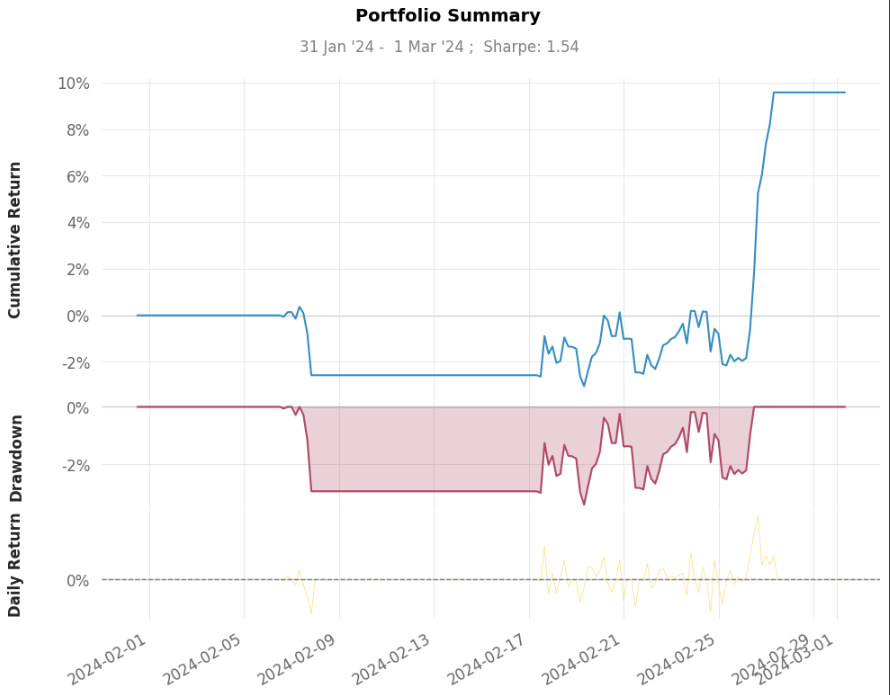

# vectorbt - qs


- vectorbt의 포트폴리오 객체는 quantstats을 내장하고 있다.  
- QSAdapter을 이용하면 된다.  
- QSAdapter > https://vectorbt.dev/api/returns/qs_adapter/  

## eg) vt - Portfolio Summary

```py
pf.qs.plot_snapshot()
```

result  


## eg) vt - html_report


```py
# error 
pf.qs.html_report(
  output=True,
)

```

## eg) quantstats - saveReportHtml  

```py
import quantstats as qs
from datetime import date
import datetime
import os


def saveReportHtml(stock, report_name, benchmarkDayReturn=None):
  if(stock.iloc[0] >= 1):
    print("warning init DayReturn is over 100%")

  dt = datetime.datetime.now(datetime.timezone.utc) # UTC 현재 시간
  now = dt.now() + datetime.timedelta(hours=9) # UTC -> UTC+9
  TODAY_DATE = now.strftime('%Y-%m-%d')
  TODAY_TIME = now.strftime('%H-%M-%S')

  report_dir = env["report_dir"]
  report_datetime = f"{TODAY_DATE} {TODAY_TIME}"
  report_pathname = os.path.join(report_dir,f"{report_name}-{report_datetime}")

  # save img
  sh = qs.plots.snapshot(
      stock,
      title=f"{report_name} (updated-{report_datetime})",
      savefig={"fname": report_pathname+".png"}
  )
  print(f"✔️ {report_name} save preview img")

  # save html
  qs.reports.html(
      stock, 
      benchmark= benchmarkDayReturn, 
      output=True,
      download_filename=report_pathname+".html",
      title=report_name
  )
  print(f"✔️ {report_name} save html full report")
```
