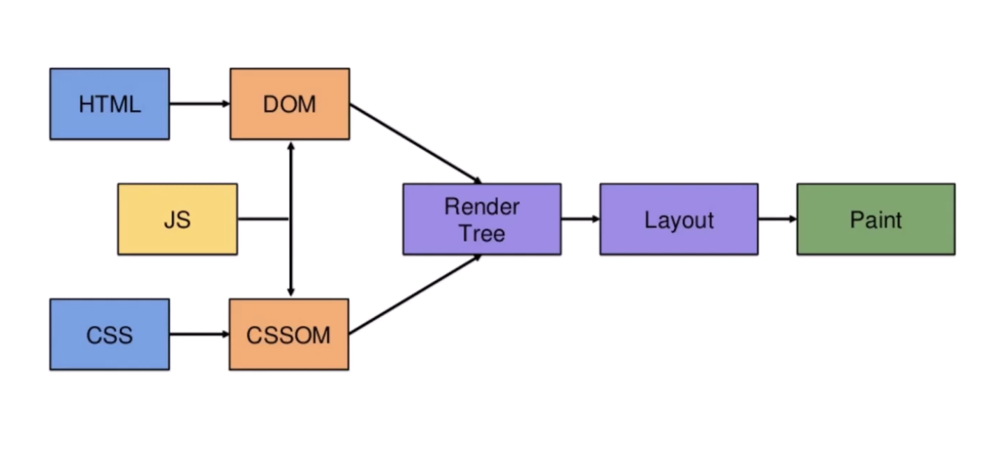
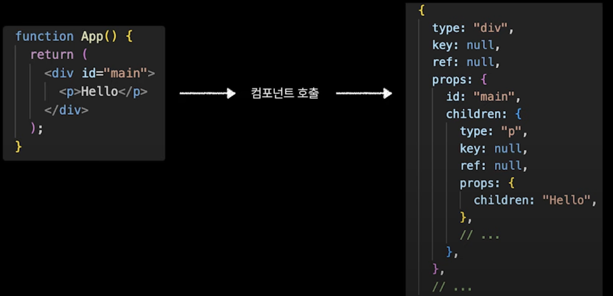
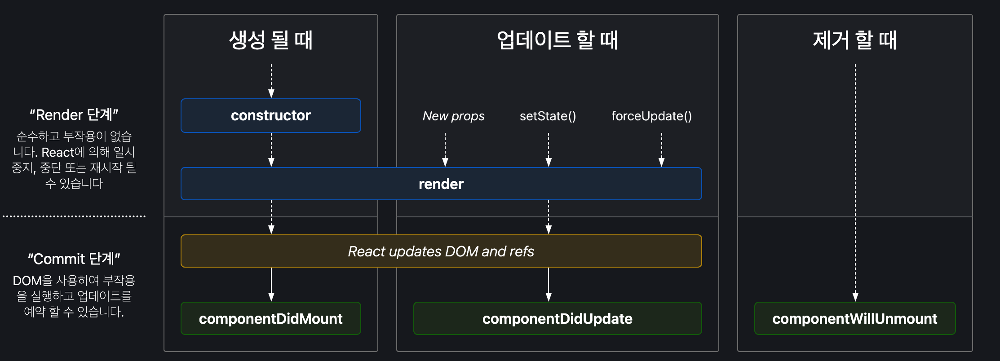
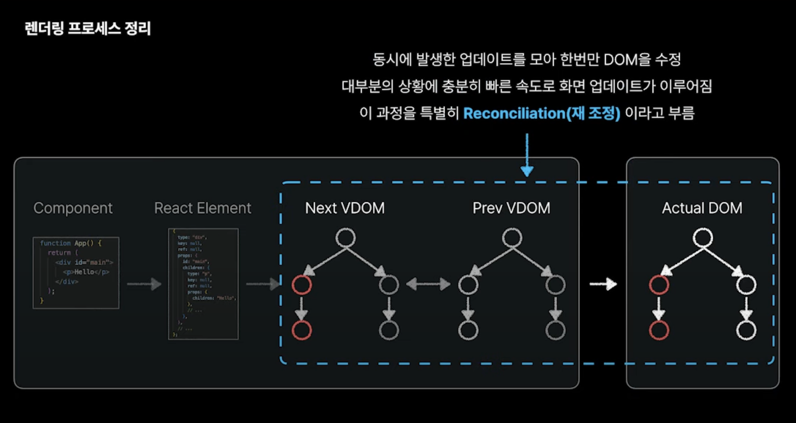
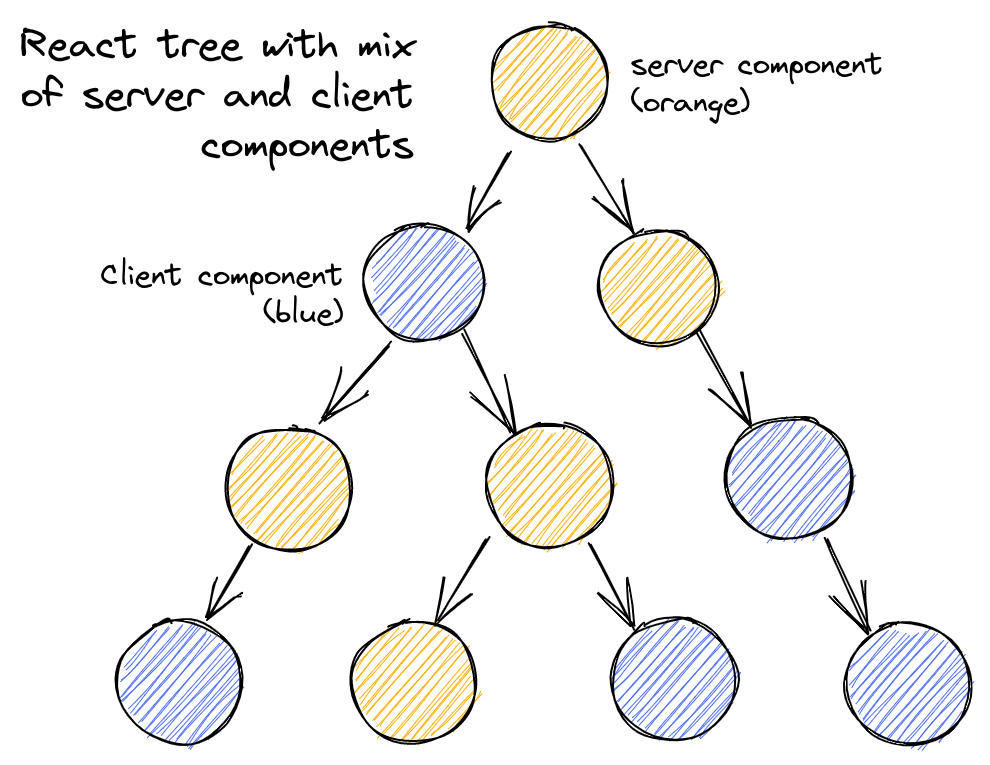

# DeepDive 브라우저, 리액트, 서버 렌더링

## 목차  

1.브라우저 렌더링    
2.리액트 렌더링    
3.Next.js 렌더링  

---

## 브라우저 렌더링




### 브라우저의 렌더링 과정은 다음과 같이 요약

1.DOM 트리 생성
- HTML이 DOM 트리로 변환되는 단계. 
- Bytes > HTML Characters > Tockens > Nodes > DOM  

2.CSSOM 트리 생성
- CSS가 CSSOM(CSS Object Model)로 변환되는 단계  
- Bytes > HTML Characters > Tockens > Nodes > DOM  

3.렌더링 트리 생성
- DOM 트리 + CSSOM 트리 => Rendering Tree  


4.레이아웃 단계
- 뷰포트 내에서 각 요소의 정확한 위치와 크기를 정확하게 캡처하는 Box 모델이 출력 

5.페인팅 단계
- 실제 픽셀로 변환하여 화면에 그리는 단계입

- 크롬은 블링크(Blink), 사파리는 웹킷(Webkit) 그리고 파이어폭스는 게코(Gecko)라는 렌더링 엔진을 사용


### 리플로우(Reflow), 리페인트(Repaint)  

언제? 
- HTML 요소 추가  
- CSS 변경  

리플로우(Reflow) : 레이아웃에 영향이 있는 변경사항이 있을때. 
- position, width, height, margin, padding, border, border-width  
- font-size, font-weight, line-height, text-align, overflow  

리페인트(Repaint)만 일어나는 대표적인 속성들입니다.  
- background, color, text-decoration, border-style, border-radius  


ref : https://medium.com/%EA%B0%9C%EB%B0%9C%EC%9E%90%EC%9D%98%ED%92%88%EA%B2%A9/%EB%B8%8C%EB%9D%BC%EC%9A%B0%EC%A0%80%EC%9D%98-%EB%A0%8C%EB%8D%94%EB%A7%81-%EA%B3%BC%EC%A0%95-5c01c4158ce

#### 최소화  

transform VS position, top, left 
- 레이아웃에 영향을 주지 않는 속성(예: opacity, transform)으로 작성. 
- position, top, left 등의 속성은 레이아웃에 영향을 주기 때문에 리플로우를 유발.   


## 리액트 렌더링  

### 용어

1.리액트 컴포넌트 
- JSX를 반환하는 함수.  
- ReactElement를 반환하는 함수.  
- JSX는 createReactElement 함수로 변환된다.    

```js
function SecondChild(){
  const handleClick = useCallback(()=>{},[])
  return <div>SecondChild</div> // JSX
}
---
function SecondChild() {
  const handleClick = useCallback(() => {}, []);
  // JSX > createReactElement
  return /*#__PURE__*/ React.createElement("div", null, "SecondChild");
}
```
>https://babeljs.io/repl



2.Virtual DOM    

VDOM은 일종의 프로그래밍 컨섭이다. 
- 인메모리 상의 가상의 둠 (ReactDOM)을 하나 띄운다.  
- 그리고 실제 DOM과 Sync를 맞춘다. (이를 재조정 Reconciliation)    
- (매번 DOM을 RePaint보다 훨씬 비용이 싸다.)  

Double Buffering 구조
    

1.Current tree
- 실제DOM에 반영된(mount) fiber Node Tree 이다.    
- *fiber node = React Element에 추가 기능이 붙어 확장.    

2.WorkInProgress tree
- Render Phase에서 작업중인 fiber Node Tree이다.  
- current node 와 alternate key를 이용해서 서로 참조를 하고 있다.  
- Commit Phase가 끝나면 current Tree가 된다. 


### 리액트의 렌더링 Phase

1.Render Phase  
- 컴포넌트를 호출하여 React Element 반환    
  - V-DOM 없다면 생성
  - V-DOM 있다면 재조정 (Reconciliation)  
    - 컴포넌트의 변경(element의 추가, 수정, 삭제)을 스케쥴러에 등록     
    - fiber 아키텍처에서는 렌더링 순서 조작 가능.  
    - useTransition 같은 훅이 있다.   
    - diffing 알고리즘 > 변경이 필요한 부분을 마킹    


2.Commit Phase  
- Reconciliation이 끝난 DOM을 실제로 반영  
- 2.1 useLayoutEffect의 동기적 실행 (blocking)
- 2.2 DOM Paint  
- 2.3 useEffect의 비동기적 실행   


https://projects.wojtekmaj.pl/react-lifecycle-methods-diagram/

### diffing 알고리즘 시간복잡도  

React는 대신, 두 가지 가정을 기반하여 O(n) 복잡도의 휴리스틱 알고리즘을 구현했습니다.  
- 1.서로 다른 타입의 두 엘리먼트는 서로 다른 트리를 만들어낸다. 
- 2.개발자가 key prop을 통해, 여러 렌더링 사이에서 어떤 자식 엘리먼트가 변경되지 않아야 할지 표시해 줄 수 있다.   
  - *type, key 의 변경 => 컴포넌트 파괴 후 재생성  




### 리렌더링이란?  
- 리액트 컴포넌트가 다시 호출되는 것   
- 위 2가지는 '새로 랜더링' 되는것으로 구분.  

리렌더링이 되는 조건  
- 1.state 가 변경  
- 2.props 가 변경  

### RenderPhase, CommitPhase Counter

```js
import React, { useRef, useEffect } from 'react';

function RenderCounterComponent() {
  const renderCount = useRef(0);
  const commitCount = useRef(0);

  renderCount.current += 1;
  console.log(`랜더 횟수: ${renderCount.current}`);

  useLayoutEffect(() => {
    commitCount.current += 1;
    console.log(`커밋 횟수: ${commitCount.current}`);
  });

  return (
    <div>
      <p>이 컴포넌트는 {renderCount.current}번 렌더링되었습니다.</p>
    </div>
  );
}

export default RenderCounterComponent;

```

## 리액트 렌더링 최적화  

불필요한 리렌더링 줄이기  

### 1.React.memo
- Render Phase 막는것이 목적  
- React.memo : 얕은 비교를 사용해서 props 비교 
- *위 얕은비교에서 객체의 경우 useMemo, 함수의 경우 useCallback 으로 동일 참조값 처리 필요.  


### 2.useCallback  

```js
const Case01 = () => {
  const handler = () => {};

  return (
    <div>
      <Second handler={handler} />
    </div>
  );
};
```
- 부모컴포넌트가 리렌더링되면 핸들러함수도 다시 만들어진다.      
- handler 함수를 useCallback 으로 감싸 동일한 참조값을 만들어 준다.    
- 여전히 리렌더링이 된다. 
- Commit Phase에서 재조정이 필요하지 않다. (확인가능?)  

### 3.useMemo
- 객체 참조는 useMemo 을 이용해서 참조값을 유지할 수 있다.  
- React.memo에서 얕은비교로 Render Phase 최소화 할 수 있다.    


### 무작정 사용하는것이 좋을까? 

  
React.memo 없이 리렌더링 방지하기  
- Component는 children를 합성하고 있다. 
  - babel 결과물을 보면 children에 createElement 함수가 없다.
  - Component 리랜더링에 의해 의존하지 않아서 리렌더링 개선 가능  


--- 

## 1.NextJS 에서 서버 컴포넌트를 렌더링하는 과정  


### 용어

1.Component 컴포넌트란?  
- 컴포넌트라고 하면 일반적으로 클라이언트 컴포넌트 이다.  
- 원래는 클라이언트 컴포넌트(RCC) 개념도 없었지만, 서버 컴포넌트 개념이 나오면서 구분짓기 위해 나왔다.   
- 리액트 컴포넌트 : JSX를 리턴하는 함수이다.  
  - 이는 props를 인자로 받고, 내부에는 state가 존재한다.    

*이하
- RCS: 리액트 서버 컴포넌트  
- CCS: 리액트 클라이언트 컴포넌트   


2.컴포넌트 렌더링 이란?  

컴포넌트 렌더링은 V-DOM을 그리는 과정 이다.  
- 2.1 JSX는 트랜스 파일링을 통해 (babel) createReactElement 함수로 변경된다.  
- 2.2 리액트 컴포넌트는 리액트 엘리먼트가 된다.  
- 2.3 리액트 엘리먼트는 객체이며 DOM을 그리기 위한 정보를 가지고 있다.  
  - 2.4 리액트 엘리먼트는 Fiber로 확장되며 이것은 V-Dom을 구성한다. 
  - 이것이 컴포넌트 렌더링이다.  
  - 2.5 V-Dom은 diffing 알고리즘을 통해서 R-DOM에 반영된다.   

>https://nextjs.org/docs/app/building-your-application/rendering/server-components#how-are-server-components-rendered  

### Rendering Chunk  

Next.js는 렌더링을 청크단위로 분리하여 처리한다.  
- Next.js는 React의 API를 사용해서 렌더링을 오케스트레이션 하는 것  

1.Route Segment Boundaries   
- chunk단위로 split 되어 렌더링. (individual route segments)  

- app Router의 loading, error 컴포넌트가 관여.  
  - 렌더링 전 : loading component
  - 렌더링 완료 : page component
  - 렌더링 오류 : error


2.Suspense Boundaries   
- Suspense 경계 > chunk단위로 split 되어 렌더링. 


```js
import { Suspense } from 'react'
import { PostFeed, Weather } from './Components'
 
export default function Posts() {
  return (
    <section>
      <Suspense fallback={<p>Loading feed...</p>}>
        <PostFeed />
      </Suspense>
      <Suspense fallback={<p>Loading weather...</p>}>
        <Weather />
      </Suspense>
    </section>
  )
}
```   

### 렌더링 5단계  

### 1~2 : 서버에서 일어나는 과정  

1.RSC > RSC Payload
- React는 서버 컴포넌트를 React 서버 컴포넌트 페이로드(RSC Payload)라는 특별한 데이터 형식으로 렌더링해요.

React 서버 컴포넌트 페이로드(RSC)
- 렌더링된 React 서버 컴포넌트 트리의 압축된 바이너리 표현이에요. 
- 이 페이로드는 클라이언트에서 React가 브라우저의 DOM을 업데이트하는 데 사용돼요. 
- RSC 페이로드에는 다음이 포함돼요:
  - 1.RCS 렌더링 결과
  - 2.Placeholders : CCS를 렌더링해야 하는 위치 + 해당 JavaScript 파일에 대한 references    
  - 3.서버 컴포넌트에서 클라이언트 컴포넌트로 전달된 모든 props

2.HTML 렌더링 결과물 출력  
- Next.js는 : RSC Payload + Client Component JavaScript instructions > 서버에서 HTML을 렌더링합니다.

### 3~5 : 브라우저에서 일어나는 과정   

3.HTML Preview  
- 브라우저에서는 SSR과정에서 생성된 HTML을 받아서 즉시 보여준다.  
- 이는 fast but non-interactive preview ( 초기 페이지 로드에만 해당, SEO 유리 )     

4.Reconcile  
- RCS Payload 를 통해 Client and Server Component trees의 Reconcile 이 일어난다.  
- Server Component trees 에는 Placeholders 가 존재한다.  
- 이 자리를 Client Component가 들어가도록 Reconcile(조정)이 일어난다.  
- 최종적으로 리액트 컴포넌트 트리=V-DOM이 만들어진다.    

5.Hydrate  
- Hydration은 interactive 만들기 위함이다.   
- Client Component JavaScript instructions 이 사용된다.  
  - 그 안에는 useState, Event Handler 함수 등이 있다.    

---

## Revisit = NextJS 에서 서버 컴포넌트를 렌더링하는 과정

>https://www.plasmic.app/blog/how-react-server-components-work  


### 서버 컴포넌트란 (What are React server components)?  
- 서버와 클라이언트(브라우저)가 협력하여 React 애플리케이션을 렌더링할 수 있게 해주는 기능이에요.   

   
- Server Side Phase : RSC  
- Client Side Phase : RSC + RSC  
  - RSC를 사용한다고 반드시 SSR을 안해도 된다.  
  - SSR에 반드시 RSC를 쓰지 않아도 된다.  

### 서버 렌더링 장점  

1.데이터 소스에 더 직접적으로 접근 가능  
- 서버는 데이터베이스, GraphQL 엔드포인트, 또는 파일 시스템과 같은 데이터 소스에 더 직접적으로 접근

2.“무거운” 코드 모듈을 효율적으로 사용 가능
- 서버는 무거운 코드 모듈 사용 가능, 브라우저 처럼 의존성을 사용할 때마다 다운로드할 필요가 없기 때문이에요.
- 브라우저는 자바스크립트 번들 크기가 작아진다.  

> 페이지 로드 속도가 빨라진다. 

### The high-level picture  

브라우저에서 리액트 작업을 몽땅 처리하지 않고 
- 서버에서 할만큼 하고, 브라우저에게 넘긴다. ( RSC payload, placeholder )   
- 브라우저는 그 이후 후속작업을 이어간다. (reconcile, hydration, lifeCycle)   


#### The server-client component divide

가장 중요한 것은 클라이언트 컴포넌트가 서버 컴포넌트를 임포트할 수 없다는 점이에요! 
- 이는 서버 컴포넌트가 브라우저에서 실행될 수 없으며, 
- 브라우저에서 작동하지 않는 코드를 포함할 수 있기 때문이에요.  

클라이언트 컴포넌트에서 서버 컴포넌트를 임포트하여 렌더링할 수는 없지만, 컴포지션을 사용할 수 있어요.  

```js
// ClientComponent.client.jsx
// NOT OK:
import ServerComponent from './ServerComponent.server'
export default function ClientComponent() {
  return (
    <div>
      <ServerComponent />
    </div>
  )
}
---
// ClientComponent.client.jsx
export default function ClientComponent({ children }) {
  return (
    <div>
      <h1>Hello from client land</h1>
      {children}
    </div>
  )
}

// ServerComponent.server.jsx
export default function ServerComponent() {
  return <span>Hello from server land</span>
}

// OuterServerComponent.server.jsx
// OuterServerComponent는 클라이언트와 서버 컴포넌트를 모두 인스턴스화할 수 있으며,
// 우리는 <ServerComponent/>를 children prop으로 ClientComponent에 전달하고 있어요.
import ClientComponent from './ClientComponent.client'
import ServerComponent from './ServerComponent.server'
export default function OuterServerComponent() {
  return (
    <ClientComponent>
      <ServerComponent />
    </ClientComponent>
  )
}

```

### React 서버 컴포넌트(RSC) 렌더링 과정 (Life of an RSC render)    

#### 1. 서버가 렌더링 요청을 받음  

- React 컴포넌트를 렌더링하기 위한 API 호출에 대한 응답으로 시작
- 서버가 일부 렌더링을 처리해야 하기 때문에, "루트" 컴포넌트는 항상 서버 컴포넌트

#### 2. 서버가 루트 컴포넌트 요소를 JSON으로 직렬화함  

기본 HTML 태그와 클라이언트 컴포넌트 "플레이스홀더"로 이루어진 트리로 렌더링
- 그런 다음 이 트리를 직렬화하고, 이를 브라우저에 보내면, 브라우저가 이 트리를 역직렬화하여 클라이언트 플레이스홀더를 실제 클라이언트 컴포넌트로 채우고 최종 결과를 렌더링.


단순히 `JSON.stringify(<OuterServerComponent />)`로 직렬화된 요소 트리를 얻을 수 없다. 
- React 요소 = 이것은 객체이며, 
  - `type` 필드
    - 문자열일 경우 기본 HTML 태그(예: "div")  
    - 함수일 경우 React 컴포넌트 인스턴스를 나타내요.   

예를 들어:
```javascript
// <div>oh my</div>에 대한 React 요소
React.createElement("div", { title: "oh my" })
{
  $$typeof: Symbol(react.element),
  type: "div",
  props: { title: "oh my" },
  ...
}

// <MyComponent>oh my</MyComponent>에 대한 React 요소
function MyComponent({children}) {
  return <div>{children}</div>;
}
React.createElement(MyComponent, { children: "oh my" })
{
  $$typeof: Symbol(react.element),
  type: MyComponent  // MyComponent 함수에 대한 참조
  props: { children: "oh my" },
  ...
}
```
- 2번째 케이스의 경우, 함수는 JSON으로 직렬화할 수 없어요!  

구체적으로 말하자면, 직렬화할 React 요소를 볼 때:

- **기본 HTML 태그를 위한 것이라면** (`type` 필드가 "div"와 같은 문자열일 경우), 직렬화 가능.
- **서버 컴포넌트를 위한 것이라면** : 서버에서 렌더링 해여, 서버 컴포넌트를 기본 HTML 태그로 변환.  
- **클라이언트 컴포넌트를 위한 것이라면** : 모듈 참조 객체로 직렬화.  


---

### "모듈 참조" 객체란 무엇인가요?

React 서버 컴포넌트(RSC)는 React 요소의 `type` 필드에 들어갈 수 있는 새로운 값인 "모듈 참조" 객체를 도입했어요. 이 값은 컴포넌트 함수 대신 직렬화할 수 있는 "참조"를 의미해요.

예를 들어, 클라이언트 컴포넌트의 요소는 다음과 같이 생겼을 수 있어요:

```javascript
{
  $$typeof: Symbol(react.element),
  // 이제 type 필드는 실제 컴포넌트 함수 대신 참조 객체를 가지고 있어요
  type: {
    $$typeof: Symbol(react.module.reference),
    // ClientComponent는 기본 내보내기(export)...
    name: "default",
    // 이 파일에서 가져와요!
    filename: "./src/ClientComponent.client.js"
  },
  props: { children: "oh my" },
}
```
"모듈 참조" 객체 = 바로 **번들러**가 수행
- React 팀은 `react-server-dom-webpack`이라는 Webpack 로더
- 서버에서 구성된 React 트리에는 클라이언트 컴포넌트 함수가 포함되지 않는다.  

위의 예시를 다시 살펴보면, `<OuterServerComponent />`를 직렬화하려고 할 때 우리는 다음과 같은 JSON 트리를 얻게 돼요:

```javascript
{
  // 모듈 참조를 가진 ClientComponent 요소 플레이스홀더
  $$typeof: Symbol(react.element),
  type: {
    $$typeof: Symbol(react.module.reference), // 
    name: "default",
    filename: "./src/ClientComponent.client.js"
  },
  props: {
    // ClientComponent에 전달된 children, 즉 <ServerComponent />.
    children: {
      // ServerComponent는 직접 HTML 태그로 렌더링돼요;
      // 여기서 ServerComponent에 대한 참조는 전혀 없고,
      // 대신 우리가 `span`을 직접 렌더링한 걸 볼 수 있어요.
      $$typeof: Symbol(react.element),
      type: "span",
      props: {
        children: "Hello from server land"
      }
    }
  }
}
```

#### The serializable React tree

이 과정의 끝에서, 서버에서 직렬화된 React 트리는 브라우저로 전송되어 "마무리" 작업을 수행하기 위해 아래와 같은 형태로 되어 있을 거예요:

Serializable React tree  
- 서버 컴포넌트는 네이티브 HTML 태그로 렌더링  
- 클라이언트 컴포넌트는 플레이스홀더로 대체된 React 트리  


#### 모든 props는 직렬화 가능해야 함

서버 컴포넌트에서 하위 컴포넌트로 이벤트 핸들러와 같은 함수를 props로 전달할 수 없다

```javascript
// 잘못된 예시: 서버 컴포넌트는 직렬화할 수 없는 함수를
// 하위 요소에 prop으로 전달할 수 없어요.
function SomeServerComponent() {
  return <button onClick={() => alert('OHHAI')}>Click me!</button>
}
```

클라이언트 컴포넌트 간에는 함수 prop을 전달하는 것이 괜찮다.  
```javascript
function SomeServerComponent() {
  return <ClientComponent1>Hello world!</ClientComponent1>;
}

function ClientComponent1({children}) {
  // 클라이언트 컴포넌트 간에는 함수 prop을 전달하는 것이 괜찮아요
  return <ClientComponent2 onChange={...}>{children}</ClientComponent2>;
}
```

---

### 3. 브라우저에서 React 트리 재구성

브라우저는 서버에서 전달된 JSON 출력을 받아, 이를 기반으로 브라우저에서 렌더링할 React 트리를 재구성해야 해요. 
- 이 과정에서 `type`이 모듈 참조인 요소를 만나면, 
- 이를 실제 클라이언트 컴포넌트 함수의 참조로 교체해야 해요.


이 작업은 다시 한 번 번들러의 도움이 필요 
- 서버에서 클라이언트 컴포넌트 함수를 모듈 참조로 교체한 것도 번들
- 브라우저에서 이 모듈 참조를 실제 클라이언트 컴포넌트 함수로 교체하는 방법을 알고 있는 것도 번들러.

재구성된 React 트리는 다음과 같아요. 기본 HTML 태그와 클라이언트 컴포넌트가 포함된 트리로
- 실제로는 기본 태그와 클라이언트 컴포넌트만 교체된 상태예요

  
- **브라우저에서 재구성된 React 트리**: 여기에는 기본 태그와 클라이언트 컴포넌트만 포함됨  
- 그 후 이 트리를 평소처럼 DOM에 렌더링하고 커밋해요.  

---

### Suspense와의 호환성

React 서버 컴포넌트(RSC)는 **Suspense**와 잘 호환돼요.  
- 간단히 설명하자면, Suspense는 React 컴포넌트에서 필요한 데이터나 컴포넌트가 아직 준비되지 않았을 때 **promise**를 던질 수 있도록 해줘요
- (예: 데이터를 가져오거나, 지연 로드되는 컴포넌트를 임포트하는 경우 등). 
- 이러한 promise는 "Suspense 경계(Suspense boundary)"에서 포착돼요.  


Suspense 하위 트리에서 promise가 던져지면, React는 그 하위 트리의 렌더링을 중단하고, promise가 해결될 때까지 기다렸다가 다시 렌더링을 시도해요.

- 서버에서 RSC 출력을 생성하기 위해 서버 컴포넌트 함수를 호출할 때, 이런 promise를 만나면, 일단 플레이스홀더를 출력해요. 

- promise가 해결되면 서버 컴포넌트 함수를 다시 호출해 성공적으로 완료된 청크를 출력해요. 
- 사실, 우리는 RSC 출력을 스트리밍하는 동안 promise가 던져질 때마다 잠시 멈췄다가, 해결되면 추가적인 청크를 스트리밍하는 방식으로 진행해요.


Suspense 덕분에
- 1.서버는 서버 컴포넌트가 데이터를 가져오는 동안 RSC 출력을 스트리밍
- 2.브라우저는 데이터가 사용 가능해질 때마다 점진적으로 렌더링 
  - 필요할 때 클라이언트 컴포넌트 번들을 동적으로 가져올 수 있어요. 
  - >사용자에게 더 나은 경험을 제공할 수 있어요.  

---

### RSC Wire Format  

React 서버 컴포넌트(RSC)가 브라우저로 전달하는 데이터
RSC는 단순한 형식을 사용해 데이터를 스트리밍하며, 각 줄에 하나의 JSON 블롭이 있고, ID로 태그가 지정

예를 들어, `<OuterServerComponent/>`의 RSC 출력은 다음과 같아요:

```js
export default function ServerComponent() {
  return <span>Hello from server land</span>
}
---
import ClientComponent from './ClientComponent.client'
import ServerComponent from './ServerComponent.server'
export default function OuterServerComponent() {
  return (
    <ClientComponent>
      <ServerComponent />
    </ClientComponent>
  )
}
---
M1:{"id":"./src/ClientComponent.client.js","chunks":["client1"],"name":""}
J0:["$","@1",null,{"children":["$","span",null,{"children":"Hello from server land"}]}]
```

- `M`으로 시작하는 줄은 클라이언트 컴포넌트 모듈 참조를 정의.
  - 이 참조에는 클라이언트 번들에서 컴포넌트 함수를 찾는 데 필요한 정보
- `J`로 시작하는 줄은 실제 React 요소 트리를 정의 
- `@1` 같은 참조는 `M` 줄에서 정의된 클라이언트 컴포넌트를 가리켜요.

이 포맷은 매우 스트리밍에 적합해요. 클라이언트는 한 줄을 읽으면 바로 JSON 스니펫을 파싱하고, 다음 작업을 진행할 수 있어요. 서버가 렌더링 중에 `Suspense` 경계를 만나면, 해당 경계가 해결될 때마다 여러 `J` 줄이 출력돼요.

### 더 복잡한 예시

다음은 좀 더 복잡한 예시예요:

```javascript
// Tweets.server.js
import { fetch } from 'react-fetch' // React의 Suspense를 지원하는 fetch()
import Tweet from './Tweet.client'
export default function Tweets() {
  const tweets = fetch(`/tweets`).json()
  return (
    <ul>
      {tweets.slice(0, 2).map((tweet) => (
        <li>
          <Tweet tweet={tweet} />
        </li>
      ))}
    </ul>
  )
}
// Tweet.client.js
export default function Tweet({ tweet }) {
  return <div onClick={() => alert(`Written by ${tweet.username}`)}>{tweet.body}</div>
}
// OuterServerComponent.server.js
export default function OuterServerComponent() {
  return (
    <ClientComponent>
      <ServerComponent />
      <Suspense fallback={'Loading tweets...'}>
        <Tweets />
      </Suspense>
    </ClientComponent>
  )
}
```
이 경우, RSC 스트림은 다음과 같이 보여요:
```json
M1:{"id":"./src/ClientComponent.client.js","chunks":["client1"],"name":""}
S2:"react.suspense"
J0:["$","@1",null,{"children":[["$","span",null,{"children":"Hello from server land"}],["$","$2",null,{"fallback":"Loading tweets...","children":"@3"}]]}]

...

M4:{"id":"./src/Tweet.client.js","chunks":["client8"],"name":""}
J3:["$","ul",null,{"children":[["$","li",null,{"children":["$","@4",null,{"tweet":{...}}}]}],["$","li",null,{"children":["$","@4",null,{"tweet":{...}}}]}]]}]
```

`J0` 줄에는 새로운 `Suspense` 경계가 추가 
- 이 경계의 자식은 `@3`을 가리키고 있어요. 주목할 점은, 이 시점에서는 `@3`이 아직 정의되지 않았다는 거예요! 
- 서버가 트윗 로딩을 완료하면, `Tweet.client.js` 컴포넌트에 대한 모듈 참조를 정의하는 `M4` 줄과, `@3` 위치에 삽입될 또 다른 React 요소 트리를 정의하는 `J3` 줄이 출력돼요.
- 또한, 번들러가 `ClientComponent`와 `Tweet`을 자동으로 두 개의 별도 번들로 분리했다는 점도 주목할 만해요. 덕분에 브라우저는 나중에 `Tweet` 번들을 다운로드할 수 있어요.

---

### Consuming the RSC Format (readRoot)  

RSC 스트림을 브라우저에서 실제 React 요소로 변환 하기 위해 `react-server-dom-webpack` 패키지 사용.
- 해당 페키지는 RSC 응답을 받아 React 요소 트리를 재구성하는 엔트리포인트가 포함
- 다음은 루트 클라이언트 컴포넌트의 단순화된 버전이에요:

```javascript
import { createFromFetch } from 'react-server-dom-webpack'

function ClientRootComponent() {
  // RSC API 엔드포인트에서 fetch() 요청을 수행해요.
  // react-server-dom-webpack은 fetch 결과를 가져와서 React 요소 트리를 재구성할 수 있어요.
  const response = createFromFetch(fetch('/rsc?...'))
  return (
    <Suspense fallback={null}>
      {response.readRoot() /* 이 메서드는 React 요소를 반환해요! */}
    </Suspense>
  )
}
```

이 코드는 `react-server-dom-webpack`을 사용해 API 엔드포인트에서 RSC 응답을 읽어와요. 그런 다음 `response.readRoot()`가 React 요소를 반환하고, 이 요소는 응답 스트림이 처리됨에 따라 계속 업데이트돼요. 스트림이 읽히기 전에는 콘텐츠가 아직 준비되지 않았으므로 즉시 promise를 던져요. 
- 첫 번째 `J0`가 처리되면, 해당 요소 트리가 생성되고 던져진 promise가 해결돼요. React는 렌더링을 재개하지만, 아직 준비되지 않은 `@3` 참조를 만나면 또 다른 promise가 던져져요. 
- `J3`를 읽으면, 그 promise가 해결되고 React는 다시 렌더링을 재개해요. 이렇게 RSC 응답을 스트리밍하면서 Suspense 경계에 의해 정의된 청크마다 요소 트리를 계속 업데이트하고 렌더링해요.

#### 왜 단순한 HTML을 출력하지 않을까요?

클라이언트 측의 목표는 React 요소 트리를 재구성하는 것이에요. 
- HTML로부터 React 요소를 생성하는 것보다 이 포맷을 사용하는 것이 훨씬 더 간단해요. 
- React 요소 트리를 재구성하는 것은 매우 중요한데, 이는 React 트리에 대한 후속 변경 사항을 DOM에 최소한의 커밋으로 병합할 수 있게 해주기 때문이에요.  


#### 클라이언트 컴포넌트에서 데이터만 가져오는 것보다 이게 더 나을까요?

- 처리된 데이터를 내려줄 것인가?  
- 처리할 데이터를 위한 도구와 데이터를 직접 받을 것인가? (JS번들 크기, API 레이턴시, 데이터의 크기)

#### 메타 프레임워크(Nextjs)가 주는 이점

- SSR 과정, RSC 스트림을 생성하고 이를 브라우저에서 소비, 번들러의 협력, 하이드레이트(hydrate) 등등.. 알아서 처리  

---

ref 
400줄의 코드로 나만의 리액트 만들기 (부제: 리액트의 원리에 대한 심층 연구) : https://ricki-lee.medium.com/400%EC%A4%84%EC%9D%98-%EC%BD%94%EB%93%9C%EB%A1%9C-%EB%82%98%EB%A7%8C%EC%9D%98-%EB%A6%AC%EC%95%A1%ED%8A%B8-%EB%A7%8C%EB%93%A4%EA%B8%B0-%EB%B6%80%EC%A0%9C-%EB%A6%AC%EC%95%A1%ED%8A%B8%EC%9D%98-%EC%9B%90%EB%A6%AC%EC%97%90-%EB%8C%80%ED%95%9C-%EC%8B%AC%EC%B8%B5-%EC%97%B0%EA%B5%AC-f4c51b96001d