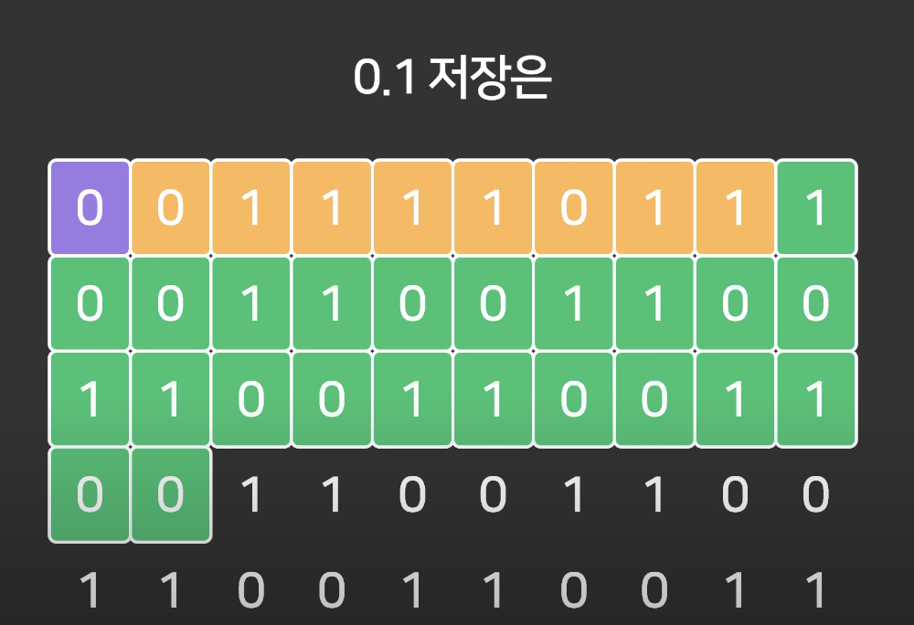

# JS 데이터 타입  

## 실수 표현  

컴퓨터에서 실수를 표현하는 방법은 2가지가 있다.  
1.고정 소수점 (fixed point)  
2.부동 소수점 (floating point)   

### 고정 소수점 비트 구조 (32bit)     
- 부호(1) + 정수부(15) + 소수부(16)  
- 1비트는 sign(부호)을 나타냅니다. 양수는 0, 음수는 1입니다.  
- 15비트는 integer part(정수부)   
- 16비트는 fractional part(소수부)     

예) 7.625를 32비트 고정 소수점으로 표현  
- 7.625 (10) = 111.101(2)    
- 2진수의 각 자리수를 계산하여 10진수로 변환할 수 있다.  
```
111.101(2) 
111.101 
111.101 = 2**2 + 2**1 + 2**0 = 4+2+1  
        + 2**(-1) + 2**(-3) = 0.5 + 0.125   
```  

  
- 장점 : 고정 소수점 방식은 실수 표현방식이 단순하여 속도가 빠르다.  
- 단점 : 소수부의 자릿수가 크지 않아 표현의 범위가 제약되어 있다.    


### 부동 소수점  비트 구조 (32bit)   

```
아래는 이해를 위해 필자가 가상으로 만든 8비트 부동소수점이다.
1.5라면 = [0001.1000]=[1.1000000]×2**0
9.75라면 = [1001.1100]=[1.0011100]×2**3
숫자가 0이 아니라면 무조건 맨 앞부분은 1이 된다.
```
  

- 32bit: 부호(1) + 지수부(8) + 가수부(23)  
- 처음 1비트는 sign(부호)를 나타냅니다 (0은 양수, 1은 음수).
- 다음 8비트는 exponent(지수부)를 나타냅니다. 정규화 과정에서 얻어낸 지수에 bias를 더한 값으로 채웁니다.
- 다음 23비트는 mantissa(가수부)를 나타냅니다. 소수 부분의 값으로 채웁니다.   
- 64bit : 부호(1) + 지수부(11) + 가수부(52)  


예) 7.625를 32비트 고정 소수점으로 표현  
- 7.625 (10) = 111.101(2)    


- 장점 : 표현할 수 있는 수의 범위가 매우 넓다.    
- 단점 : 실수를 이진법으로 변환하는 과정에서 무한소수, 이는 정밀도를 낮춘다.  

## JavaScript에서 실수 처리 

64비트 부동소수점 (double-precision floating-point) 형식을 사용  
- 부호 비트: 1비트 + 지수부(스케일): 11비트 + 가수부(정밀도): 52비트  
- 지수부는 숫자의 스케일을 결정하며, 가수부는 숫자의 정밀도를 결정.     
- 소수점 이하 15~16자리까지의 정밀도를 보장  

### 정밀도 손실, loss of precision  

```js
아래 와 같이 정밀도 손실이 발생한다.  

let num1 = 0.1;
let num2 = 0.2;
let sum = num1 + num2;
console.log(sum);  // 0.30000000000000004
---
이는 정밀도 표현 부분이 무한 반복되어 그렇다. 이런 경우 숫자로 반올림 한다.  
(0.1).toString(2)
'0.0001100110011001100110011001100110011001100110011001101'
```

  

부동소수점은 무한소수의 한계점이 있을 수 밖에 없다.  
- 정확히 계산하려면 정수로 바꾸어서 계산한다.   
- 5.1 달러 대신 5100 센트  

