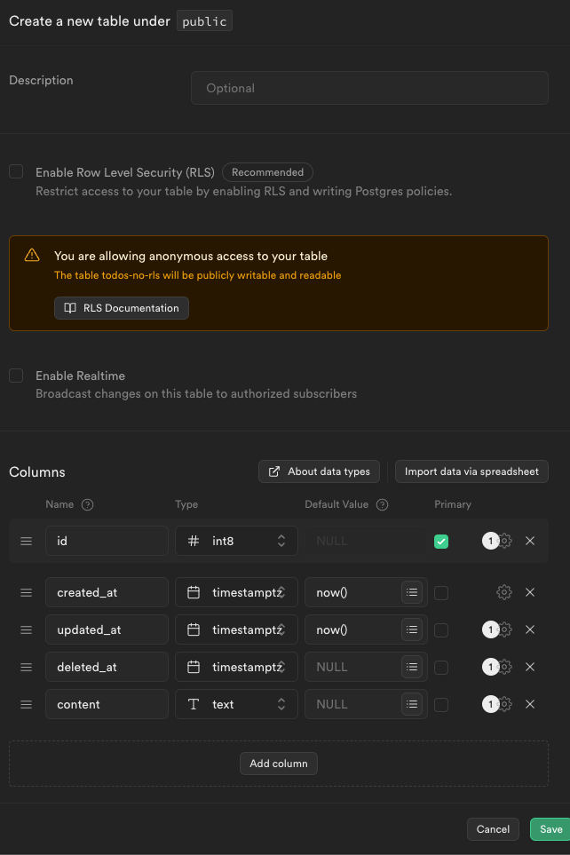

# Supabase JS SDK

- [Supabase JS SDK](#supabase-js-sdk)
  - [Next actions + supabase client](#next-actions--supabase-client)
  - [Select](#select)
  - [Mutation](#mutation)





## Next actions + supabase client

supabase client
- 기본적으로 public 스키마를 디폴트로 가르키고 있다.  

Next actions
- 아래 예시는 actions를 이용한 예이다.  
- 서버액션으로 사용하기 위해서 "use server"; 선언 및 비동기 함수로 정의하자.    
- 참고 - https://www.youtube.com/watch?v=PdmKlne1gRY   

주의점  
- 서버 액션은 서버 컴포넌트를 포함한 미들웨어, 다른 서버 액션, 라우터 핸들러에서 호출될 수 있다.  
- 이때 서버 컴포넌트에서 SSR 중에 서버 액션을 부르게 되면 쿠키에 대한 조작을 금지 해야 한다.  
- 그래서 액션한테 어떠한 곳에서 서버 액션을 불렀는지 알려주어야 한다.   


## Select  

```js
let { data: chat, error } = await supabase
  .from('chat')                     // 'chat' 테이블을 선택
  .select("*")                      // 테이블의 모든 컬럼을 조회
  // Filters (필터 조건 설정)
  .eq('column', 'Equal to')         // NULL 외 값을 비교한다.   
  .gt('column', 'Greater than')     // 
  .lt('column', 'Less than')        // 
  .gte('column', 'Greater than or equal to') // 
  .lte('column', 'Less than or equal to')   // 
  .like('column', '%CaseSensitive%')       //  CaseSensitive 
  .ilike('column', '%CaseInsensitive%')    // CaseInsensitive
  .is('column', null)                     // IS NULL
  .in('column', ['Array', 'Values'])       // 
  .neq('column', 'Not equal to')          // 'column' 값이 'Not equal to'와 일치하지 않는 행 필터
  // Arrays (배열 관련 조건 설정)
  .contains('array_column', ['array', 'contains']) // 'array_column'이 배열 ['array', 'contains']를 포함하는 행 필터
  .containedBy('array_column', ['contained', 'by']) // 'array_column'이 배열 ['contained', 'by']에 완전히 포함되는 행 필터
---
.eq('column', 'Equal to')
SELECT * FROM chat WHERE column = 'Equal to';

.neq('column', 'Not equal to')
SELECT * FROM chat WHERE column != 'Not equal to';

.gt('column', 'Greater than')
SELECT * FROM chat WHERE column > 'Greater than';

.lt('column', 'Less than')
SELECT * FROM chat WHERE column < 'Less than';

.gte('column', 'Greater than or equal to')
SELECT * FROM chat WHERE column >= 'Greater than or equal to';

.lte('column', 'Less than or equal to')
SELECT * FROM chat WHERE column <= 'Less than or equal to';

.like('column', '%CaseSensitive%')
SELECT * FROM chat WHERE column LIKE '%CaseSensitive%';

.ilike('column', '%CaseInsensitive%')
SELECT * FROM chat WHERE column ILIKE '%CaseInsensitive%';

.is('column', null)
SELECT * FROM chat WHERE column IS NULL;

.in('column', ['Array', 'Values'])
SELECT * FROM chat WHERE column IN ('Array', 'Values');

.contains('array_column', ['array', 'contains'])
SELECT * FROM chat WHERE array_column @> ARRAY['array', 'contains'];

.containedBy('array_column', ['contained', 'by'])
SELECT * FROM chat WHERE array_column <@ ARRAY['contained', 'by'];

```

```js
"use server";
import { createServerSideClient } from "@/lib/supabase";

interface ContextProps {
  serverComponent?: boolean;
}

export const getTodosPublic = async (ctx?: ContextProps) => {
  const supabase = await createServerSideClient(ctx?.serverComponent);
  const result = await supabase
    .from("todos-public")
    .select("*")
    .is("deleted_at", null)
    .order("id", { ascending: false });

  return result.data;
};

export const getTodosPublicById = async (id: number, ctx?: ContextProps) => {
  const supabase = await createServerSideClient(ctx?.serverComponent);
  const result = await supabase
    .from("todos-public")
    .select("*")
    .is("deleted_at", null)
    .eq("id", id);

  return result.data?.[0];
};

export const getTodosPublicBySearch = async (
  terms: string,
  ctx?: ContextProps
) => {
  const supabase = await createServerSideClient(ctx?.serverComponent);
  const result = await supabase
    .from("todos-public")
    .select("*")
    .is("deleted_at", null)
    .ilike("content", `%${terms}%`);

  return result.data;
};

```


## Mutation  

- update는 eq로 선택 + update안에는 업데이트 할 내용을 적어준다.  
- softDelete는 string타입(ISO)으로 삭제된 날짜를 넘겨주면서 구현한다.  

```js
// single insert  
  const result = await supabase
    .from("todos-public")
    .insert({ content })
    .select();


// multiple insert
  const rows = [
    { column1: 'value1', column2: 'value2' },
    { column1: 'value3', column2: 'value4' },
    { column1: 'value5', column2: 'value6' },
  ];

  const { data, error } = await supabase
    .from('your_table_name')
    .insert(rows);

// single update
 const result = await supabase
    .from("todos-public")
    .update({ content, updated_at: new Date().toISOString() })
    .eq("id", id)
    .select();

// multiple update
  const { data, error } = await supabase
    .from('your_table_name')
    .update({ column_name: 'new_value' }) // 업데이트할 값
    .in('id', [1, 2, 3]); // 조건: id가 1, 2, 3인 행들

// soft delete
const result = await supabase
    .from("todos-public")
    .update({ deleted_at: new Date().toISOString() })
    .eq("id", id)
    .select();

// hard delete
const result = await supabase.from("todos-public").delete().eq("id", id);

```